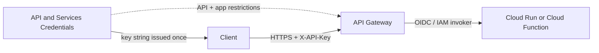
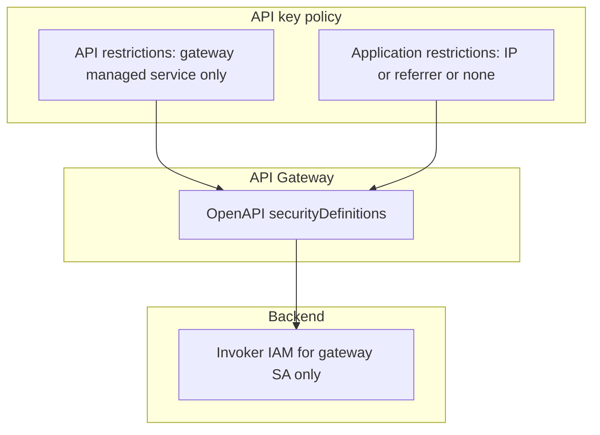

# Architecture: Restricted API key for API Gateway

## Components

| Component | Role |
|-----------|------|
| Client (ETL, notebook, partner) | Holds `YOUR_API_KEY`; calls only `GATEWAY_HOST` |
| API & Services (Credentials) | Creates key; stores API + application restrictions |
| API Gateway | Validates key against OpenAPI security; proxies to backend |
| Gateway service account | Invokes Cloud Run / Cloud Functions (`roles/run.invoker` / `roles/cloudfunctions.invoker`) |
| Backend | Never sees the public API key as its primary auth; trusts gateway IAM |

## Diagram

## Restriction layers

Three independent controls:

1. **API restrictions** — key may only call the gateway’s managed service (and nothing else enabled in the project).
2. **Application restrictions** — optional IP / referrer lock when the client topology supports it.
3. **Backend IAM** — even with a valid key, only the gateway SA should reach Cloud Run / Functions.

Losing any one layer still leaves the others. Losing all three is the unrestricted-key failure mode.

## Environment separation

| Environment | Key | Gateway | Backend |
|-------------|-----|---------|---------|
| dev | `...-dev` key, restricted to dev API | `GATEWAY_HOST` dev | Dev Cloud Run / Function |
| prod | separate key, never shared with dev | prod hostname | prod invoker grants |

Do not encode real project IDs into shared scripts checked into this repo — keep `PROJECT_ID` as a runtime placeholder.

## IAM checklist

- Restrict the key to the API Gateway API’s service name (from `gcloud api-gateway apis describe` / Console).
- Prefer denying `allUsers` invoker on the backend.
- Store the key in Secret Manager or the client’s secret store — not in OpenAPI YAML.
- On rotate: create new restricted key → update clients → delete old key → confirm 403 on the old string.
