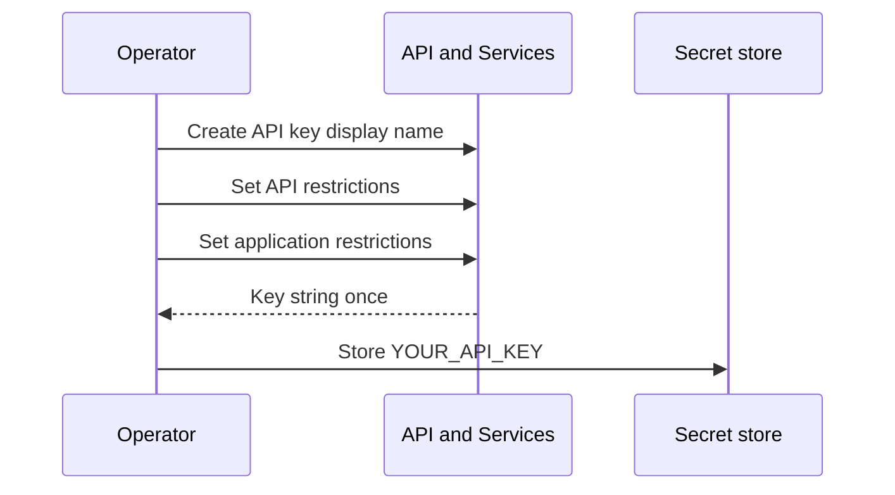
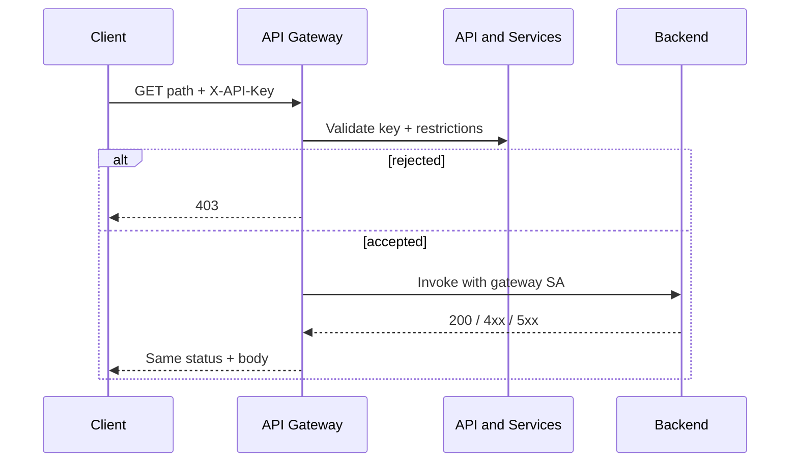
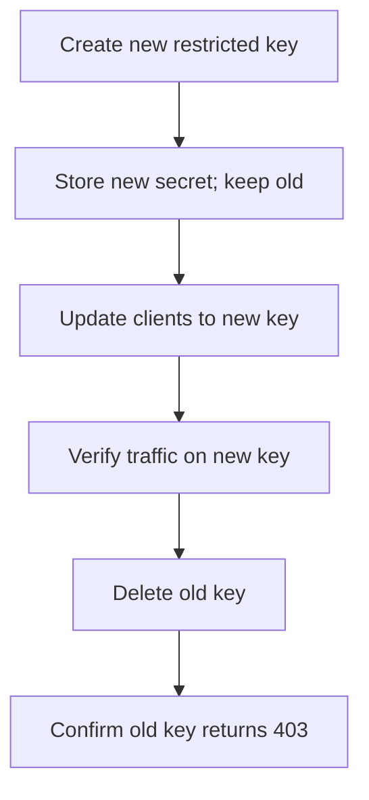

# Data flow: create, restrict, call, rotate

## Create and restrict

1. Operator enables API Gateway (and related) APIs in `PROJECT_ID` if not already on.
2. Operator creates an API key with a display name that encodes purpose + environment (example: `analytics-sessions-prod`).
3. Operator sets **API restrictions** to the managed service for that gateway API only.
4. Operator sets **application restrictions** when possible:
   - Fixed ETL egress → one or more CIDR / IP allow entries
   - Browser-only tool → HTTP referrer allowlist (know the spoofability tradeoff)
   - Controlled server client with no stable IP → application restriction “none”, compensate with API restriction + short rotation + secret storage
5. Key string is copied once into Secret Manager / client secret store. It is never committed.

## Call path (happy)

1. Client reads `YOUR_API_KEY` from its secret store.
2. Client calls `https://GATEWAY_HOST/...` with `X-API-Key` (preferred) or the query form your OpenAPI declared.
3. API & Services / Gateway validates the key against restrictions.
4. Invalid / wrong API / wrong IP → **403** at the edge; backend never runs.
5. Valid → gateway proxies with its service account; backend returns payload.

## Rotation (dual key)

Backends and OpenAPI configs stay put. Only credential distribution changes.

## Failure modes

| Symptom | Likely cause | What to check |
|---------|--------------|---------------|
| 403 after key create | API restriction mismatch | Key allowed APIs vs gateway managed service name |
| 403 from some networks only | IP application restriction | Egress IP of Cloud Run / NAT / office VPN |
| Browser 403, curl OK | Referrer restriction | Exact referrer allow entries; `*` rules |
| Works on wrong API | Key left unrestricted | Credentials → API restrictions must not be “don’t restrict” |
| Key in access logs | Query `?key=` usage | Prefer header; scrub logs; rotate |
| Old key still works after rotate | Delete skipped | Delete old credential; retest |

## Logging and privacy

- Never log the full key. If you must correlate, use key display name / last-four from Console metrics — not the secret.
- Treat keys like passwords in tickets and screenshots.
- After any suspected leak: create a new restricted key, cut over, delete the old one immediately.
