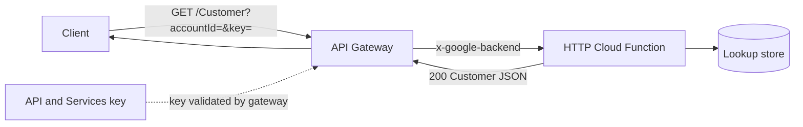
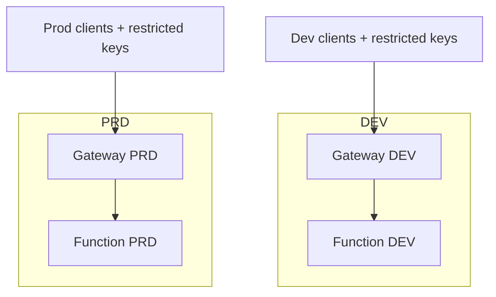

# Architecture: Customer lookup via API Gateway

## Components

| Component | Role |
|-----------|------|
| Client | Internal tool or dashboard calling HTTPS |
| API Gateway | Validates API key, terminates TLS, proxies to backend |
| API key (API & Services) | Credential bound to this API / gateway |
| Cloud Function (HTTP) | Looks up account → returns env URLs (JSON) |
| Data store (optional) | BigQuery / Firestore / SQL behind the function — not part of this pattern's config |

## Diagram

## Environment separation

Ship **separate API configs** (or at least separate `x-google-backend.address` values) for dev and prod. Do not encode project IDs in shared libraries — keep them in the OpenAPI deployed per environment.

## Operability notes

- Treat the OpenAPI file as the source of truth for routes and auth requirements.
- If the backend 403s while the gateway accepts the key, check function IAM (gateway service account invoker role).
- Prefer restricting API keys by API + optional referrer/IP (see `api-and-services-keys/` patterns).
