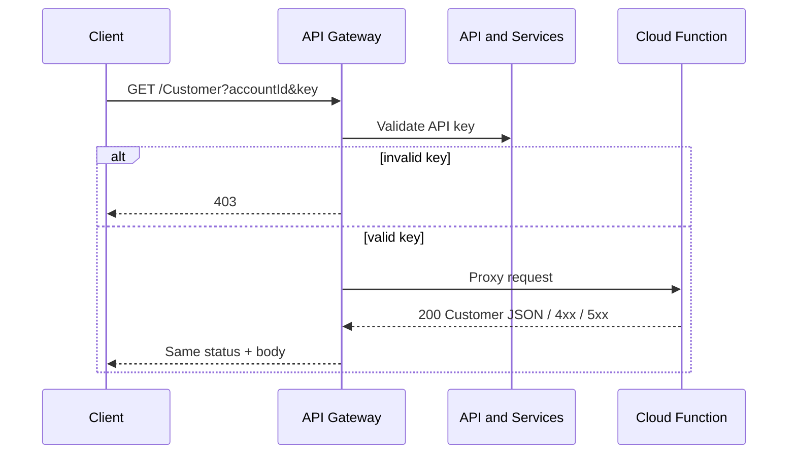

# Data flow: Customer lookup

## Happy path

1. Client sends `GET /Customer?accountId=<id>&key=<YOUR_API_KEY>` to `GATEWAY_HOST`.
2. API Gateway checks the key against API & Services. Invalid / missing key → **403** at the edge.
3. Gateway proxies to `x-google-backend.address` (Cloud Function), preserving query params needed by the function (minus gateway-only handling as configured).
4. Function validates `accountId`, queries the lookup store, returns JSON:

```json
{
  "account_id": 12345,
  "app_prod_url": "https://app.example.com/...",
  "app_stg_url": "https://stg.example.com/...",
  "app_acc_url": "https://acc.example.com/...",
  "app_dev_url": "https://dev.example.com/..."
}
```

5. Gateway returns **200** with that body to the client.

## Failure modes

| Symptom | Likely cause | What to check |
|---------|--------------|---------------|
| 403 from gateway | Bad / missing API key | Key restriction, enabled APIs, correct `key` query name |
| 403 from backend | Function IAM | Gateway SA has `roles/cloudfunctions.invoker` (or Cloud Run invoker) |
| 404 | Unknown account | Function lookup logic / source table |
| 400 | Bad `accountId` | Type / required query param |
| 504 / deadline | Cold start or slow query | Raise `x-google-backend.deadline`; fix function latency |
| 500 | Unhandled backend error | Function logs (structured JSON preferred) |

## Logging and privacy

- Do not log full API keys. Prefer logging key fingerprint / consumer project if available.
- Account IDs may still be sensitive in some orgs — apply the same retention rules as other customer identifiers.
- Gateway request logs and function logs are separate; correlate with request IDs when debugging.

## Sequence


