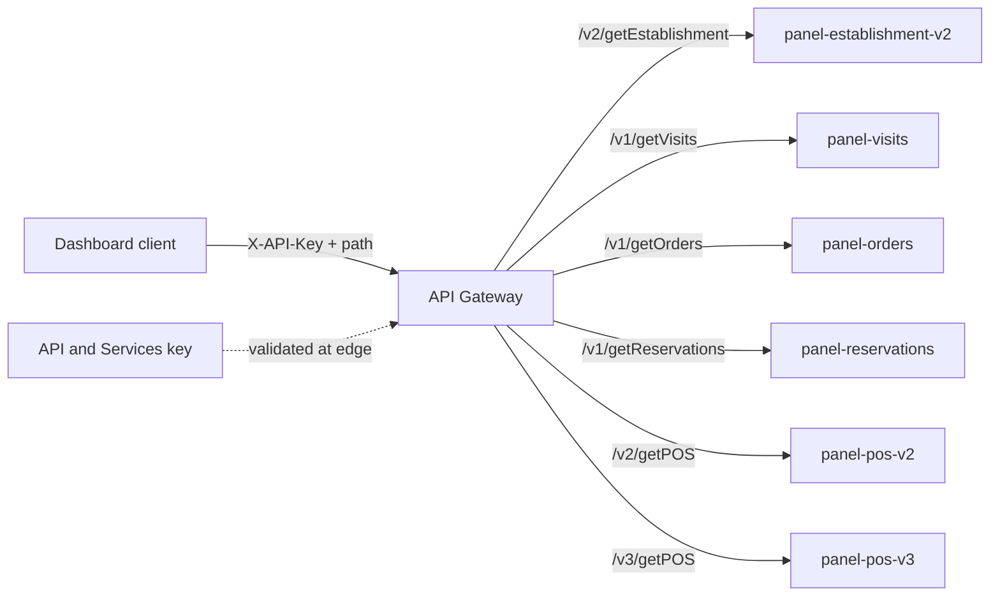
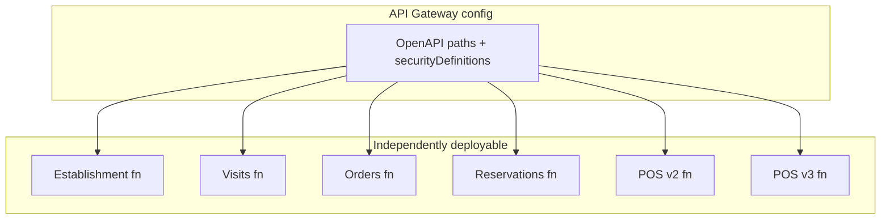

# Architecture: Multi-route dashboard via API Gateway

## Components

| Component | Role |
|-----------|------|
| Dashboard / partner client | Calls HTTPS routes with `X-API-Key` |
| API Gateway | One hostname; validates key; routes by path |
| API key (API & Services) | Credential restricted to this API / gateway |
| Cloud Functions (HTTP) | One function (or version) per path group |
| Analytics / warehouse tables | Behind the functions — not in this OpenAPI |

## Diagram

## Why per-route backends

Pattern 01 used one backend for one path. Here the OpenAPI is the composition layer:

- Visits and POS can live in different regions or projects if needed (keep that rare).
- `/v2/getPOS` and `/v3/getPOS` can point at different function revisions during migration.
- A bad deploy on POS does not require redeploying the establishment function binary — only a gateway config change if the address changes.

## IAM checklist

- Gateway service account needs `roles/cloudfunctions.invoker` (or Cloud Run invoker) on **each** backend.
- Prefer denying `allUsers` invoker on the functions; only the gateway SA should call them.
- Rotate API keys independently of function deploys.

## Environment separation

Ship separate OpenAPI configs (or at least different `x-google-backend.address` values) for dev and prod. Do not bake project IDs into shared libraries — keep them in the deployed spec.
