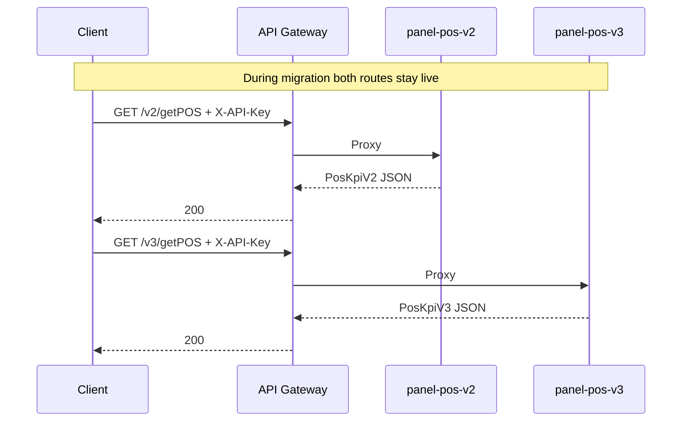
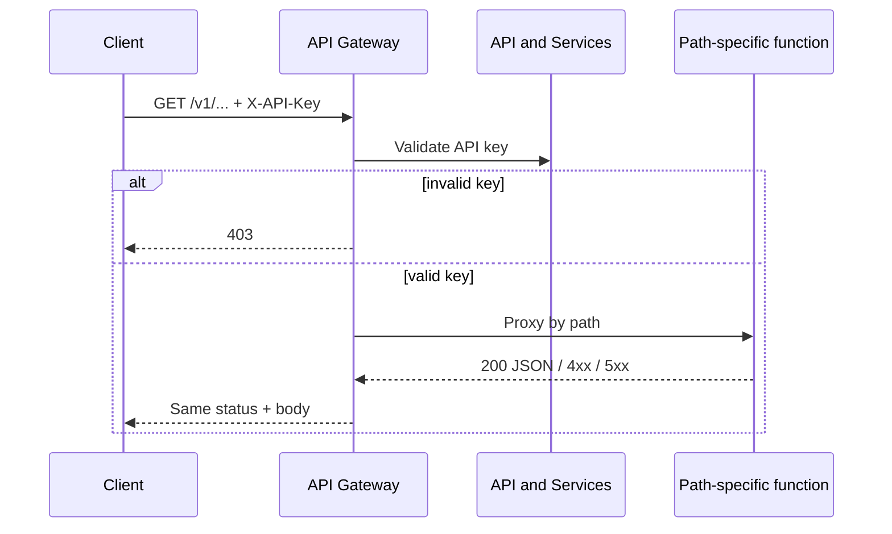

# Data flow: Multi-route dashboard

## Happy path (example: visits)

1. Client sends `GET /v1/getVisits?establishmentId=<id>&limit=20` to `GATEWAY_HOST` with header `X-API-Key: YOUR_API_KEY`.
2. API Gateway validates the key. Missing / invalid → **403** at the edge (no backend hop).
3. Gateway matches the path to `x-google-backend.address` for `/v1/getVisits` and proxies the request.
4. Visits function validates params, queries its store, returns a JSON array of visit rows.
5. Gateway returns that status and body to the client.

Other routes follow the same edge auth + path-specific backend hop. Only the function URL and response schema change.

## Versioned POS migration

Retire `/v2/getPOS` only after clients move. Removing a path is a new API config id + gateway update.

## Failure modes

| Symptom | Likely cause | What to check |
|---------|--------------|---------------|
| 403 at gateway | Bad / missing `X-API-Key` | Key restriction, header name, enabled APIs |
| 403 from one route only | Function IAM on that backend | Gateway SA invoker on **that** function |
| 404 establishment | Unknown id | Backend lookup / source table |
| 400 on dates | Pattern mismatch | Clients send `DD-MM-YYYY` for this API |
| 504 / deadline on POS | Heavy query / cold start | Raise path `deadline`; fix function latency |
| One route 500, others OK | Isolated backend fault | Logs for that function only |

## Logging and privacy

- Do not log full API keys. Prefer consumer project / key fingerprint if available.
- `establishmentId` is often customer-identifying — apply the same retention rules as other account identifiers.
- Correlate gateway request logs with function logs using request IDs when a single path misbehaves.

## Generic sequence

