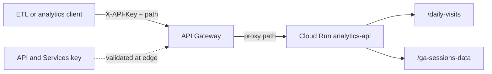
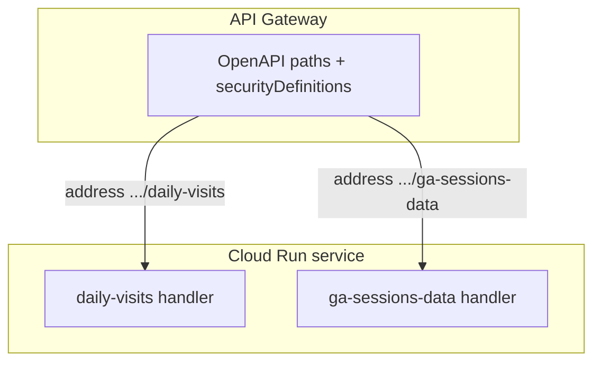

# Architecture: Analytics sessions via API Gateway + Cloud Run

## Components

| Component | Role |
|-----------|------|
| ETL / notebook / partner client | Calls HTTPS routes with `X-API-Key` |
| API Gateway | One hostname; validates key; routes by path |
| API key (API & Services) | Credential restricted to this API / gateway |
| Cloud Run service | Serves `/daily-visits` and `/ga-sessions-data` |
| Analytics / warehouse tables | Behind Cloud Run — not in this OpenAPI |

## Diagram

## Why Cloud Run path backends

Pattern 01/03 used Cloud Functions hostnames (`*.cloudfunctions.net/<name>`). Here each `x-google-backend.address` is a Cloud Run URL **including the path**:

- One service binary can own related extract routes.
- Gateway still presents a stable public hostname and key model.
- IAM is `roles/run.invoker` for the gateway service account on that Cloud Run service (once), not per-function grants.

## IAM checklist

- Gateway SA needs `roles/run.invoker` on the Cloud Run service.
- Prefer denying `allUsers` invoker on Cloud Run; only the gateway SA should call it.
- Restrict the API key to this API in API & Services; rotate keys without redeploying Run.
- If you split into two Cloud Run services later, update both addresses and grant invoker on each.

## Environment separation

Keep separate OpenAPI configs (or at least different `x-google-backend.address` values) for dev and prod. Do not bake real project numbers into shared libraries — placeholders stay in the deployed spec.
