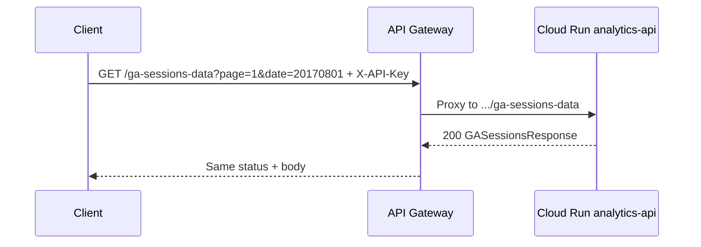
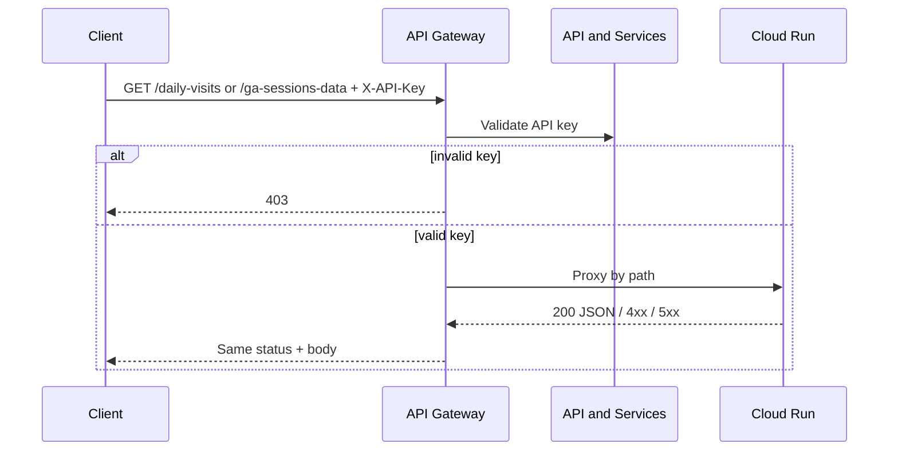

# Data flow: GA sessions / daily-visits

## Happy path (daily visits)

1. Client sends `GET /daily-visits?page=1&limit=50&start_date=2017-07-01` to `GATEWAY_HOST` with header `X-API-Key: YOUR_API_KEY`.
2. API Gateway validates the key. Missing / invalid → **403** at the edge (no Cloud Run hop).
3. Gateway proxies to the Cloud Run address for `/daily-visits` (URL includes that path).
4. Service applies filters, pages the result set, returns `DailyVisitsResponse` (`records` + `pagination` + metadata).
5. Gateway returns that status and body to the client.

## Nested sessions path

Same edge auth. Query params switch to `date` (`YYYYMMDD`), optional `country` / `device_category` / `channel_grouping`. Response uses nested `GASession` objects. Deadline on this route is higher because nested payloads and warehouse reads tend to be slower.



## Pagination loop (ETL)

```mermaid
flowchart TD
  start[Start page=1]
  call[GET route with page + limit]
  write[Write records to sink]
  check{pagination.has_next?}
  next[page = page + 1]
  done[Stop]

  start --> call --> write --> check
  check -->|yes| next --> call
  check -->|no| done
```

Prefer `has_next` over inventing off-by-one logic from `total_pages`. Cap `limit` at 500 in the contract so a buggy client cannot request an unbounded page.

## Failure modes

| Symptom | Likely cause | What to check |
|---------|--------------|---------------|
| 403 at gateway | Bad / missing `X-API-Key` | Key restriction, header name, enabled APIs |
| 403 from Cloud Run | Invoker IAM | Gateway SA `roles/run.invoker` on the service |
| 400 on dates | Pattern mismatch | Daily uses `YYYY-MM-DD`; sessions use `YYYYMMDD` |
| 404 empty | Filters too tight / wrong partition date | Backend logs; available date range |
| 504 / deadline on sessions | Heavy nested query | Raise path `deadline`; fix Run latency / cold start |
| Flat route OK, nested 500 | Handler fault on sessions only | Cloud Run revision logs for that path |

## Logging and privacy

- Do not log full API keys. Prefer consumer project / key fingerprint if available.
- Session payloads can include geo and traffic fields — treat retention like other analytics PII-adjacent data even when the demo dataset is public.
- Correlate gateway request logs with Cloud Run request logs when only one path fails.

## Generic sequence


