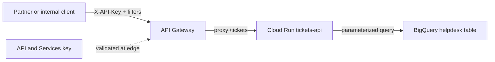
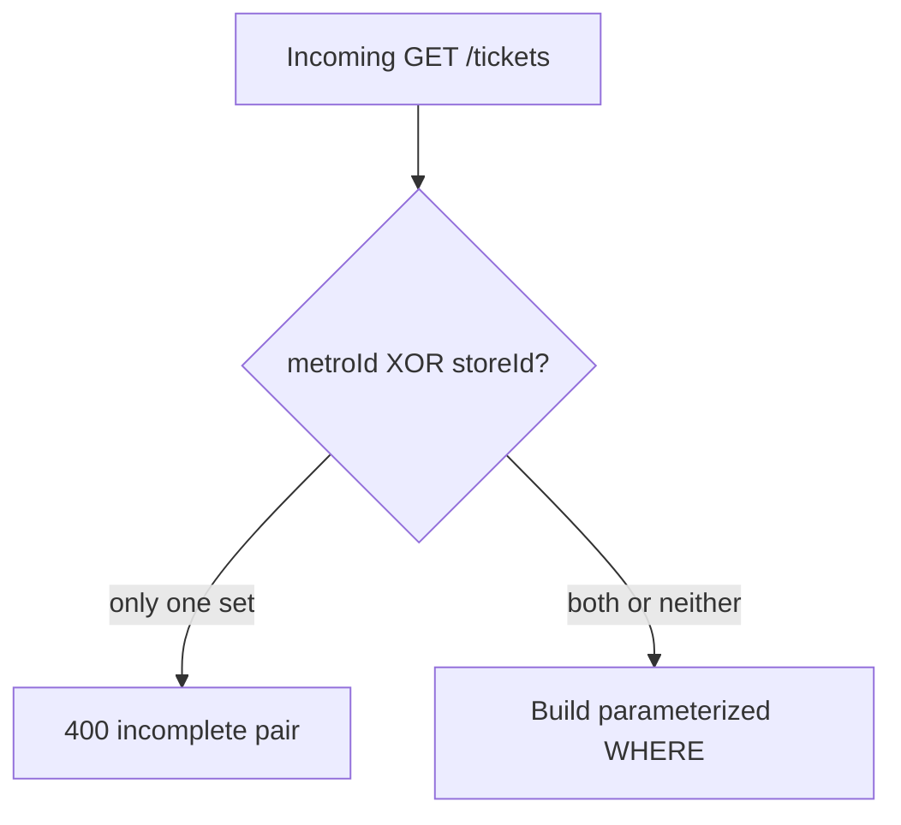

# Architecture: multi-filter tickets via API Gateway + Cloud Run

## Components

| Component | Role |
|-----------|------|
| Partner / internal client | Calls `GET /tickets` with `X-API-Key` and optional filters |
| API Gateway | Validates key; proxies to Cloud Run |
| API key (API & Services) | Credential restricted to this API / gateway |
| Cloud Run (or HTTP Cloud Function) | Enforces paired filters; parameterized BQ query |
| BigQuery helpdesk table | Source of ticket rows — table id from env |

## Diagram

## Paired filter contract

OpenAPI lists `metroId` and `storeId` as independently optional. Reality is stricter:

Other filters (`establishmentId`, `metroAccountIdentifier`) are independent. Combining several filters is AND semantics in the WHERE clause — document that for consumers so they do not expect OR.

## IAM checklist

- Gateway SA needs `roles/run.invoker` on the Cloud Run service.
- Prefer denying `allUsers` invoker on Cloud Run; only the gateway SA should call it.
- Restrict the API key to this API in API & Services; rotate keys without redeploying Run.
- Cloud Run runtime SA needs BigQuery job user + data viewer (or equivalent) on the tickets dataset — not the gateway SA.

## Environment separation

- Dev vs prod: separate OpenAPI configs (different `x-google-backend.address`) and different `TICKETS_BQ_TABLE` / `TICKETS_COUNTRY_SCOPE` values.
- Prefer Secret Manager (or `--set-secrets`) for table ids and any future secrets; avoid dumping long-lived secrets into `--set-env-vars` history.
- Keep `EXPOSE_ERROR_DETAIL` off in prod.

## Why include the handler here

Most gateway patterns in this repo stop at OpenAPI. This folder includes `main.py` because the engineering value is the **compound filter + parameterized SQL** pairing — the gateway YAML alone cannot show the 400 pair check or the `@param` query job.
