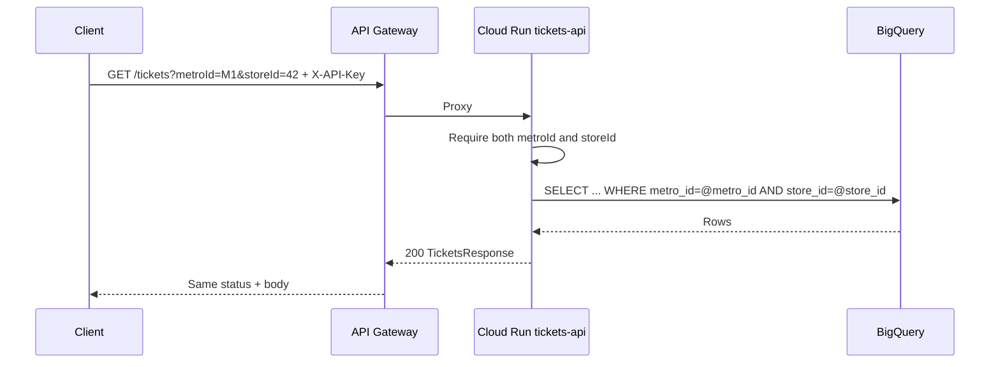
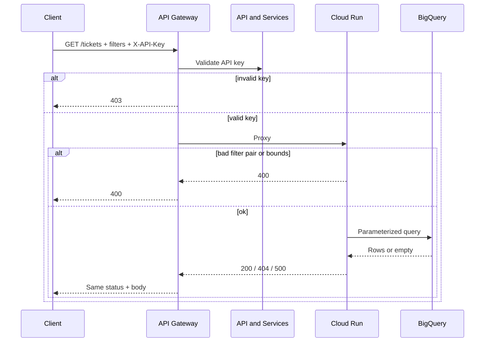

# Data flow: multi-filter helpdesk tickets

## Happy path

1. Client sends `GET /tickets?establishmentId=EST-001&offset=0&limit=50` to `GATEWAY_HOST` with header `X-API-Key: YOUR_API_KEY`.
2. API Gateway validates the key. Missing / invalid → **403** at the edge (no Cloud Run hop).
3. Gateway proxies to the Cloud Run `x-google-backend` address.
4. Handler validates filter combinations and offset/limit, runs a parameterized BigQuery job, returns `{records, count}`.
5. Gateway returns that status and body to the client.

## Paired metro + store path



Incomplete pair (`metroId` without `storeId`, or the reverse) stops in the handler with **400** — no warehouse round trip needed for that case.

## Offset / limit paging

This surface uses classic offset/limit and a `count` of rows in the current page — not a `has_next` envelope. Cap `limit` at 1000 in both the OpenAPI contract and the handler so a buggy client cannot request an unbounded page.

```mermaid
flowchart TD
  start[Start offset=0]
  call[GET /tickets with filters + limit]
  write[Consume records]
  check{count == limit?}
  next[offset = offset + limit]
  done[Stop or stop on 404]

  start --> call --> write --> check
  check -->|likely more| next --> call
  check -->|short page| done
```

Treat a **404** (no tickets for filters) as empty result for that filter set, not as a transport failure.

## Failure modes

| Symptom | Likely cause | What to check |
|---------|--------------|---------------|
| 403 at gateway | Bad / missing `X-API-Key` | Key restriction, header name, enabled APIs |
| 403 from Cloud Run | Invoker IAM | Gateway SA `roles/run.invoker` on the service |
| 400 incomplete pair | Only metroId or only storeId | Client must send both or neither |
| 400 on limit/offset | Out of range or non-integer | OpenAPI min/max; handler caps |
| 404 empty | Filters too tight / wrong country scope | `TICKETS_COUNTRY_SCOPE`; backend logs |
| 500 from BQ | Table / IAM / syntax | Runtime SA roles; `TICKETS_BQ_TABLE`; keep detail gated |

## Logging and privacy

- Do not log full API keys. Prefer consumer project / key fingerprint if available.
- Log which filter **dimensions** were set (booleans), not raw id values, when ids are customer-sensitive.
- Ticket payloads can include account and store identifiers — treat retention like other support data.
- Correlate gateway request logs with Cloud Run logs when only certain filter combos fail.

## Generic sequence


