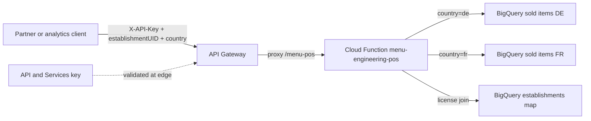
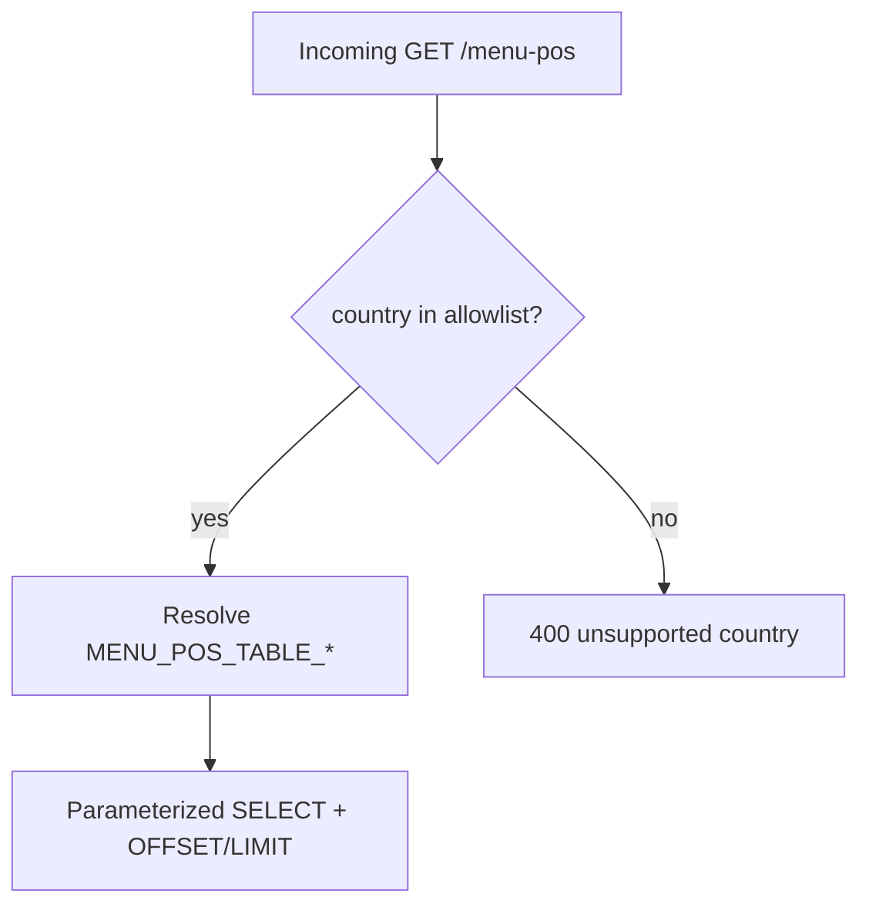

# Architecture: menu-engineering country-split via API Gateway

## Components

| Component | Role |
|-----------|------|
| Partner / analytics client | Calls `GET /menu-pos` with `X-API-Key`, establishment, optional country/dates/paging |
| API Gateway | Validates key; proxies to HTTP Cloud Function |
| API key (API & Services) | Credential restricted to this API / gateway |
| HTTP Cloud Function | Country allowlist → table map; parameterized BQ query |
| BigQuery sold-items tables | Country-scoped fact tables (`…_de`, `…_fr`, …) |
| BigQuery establishments map | License id → establishment id join |

## Diagram

## Country → table selection

OpenAPI publishes `country` as an enum. The handler resolves it through an env-backed map — never by concatenating the query string into a table identifier.

## IAM checklist

- Gateway SA needs `cloudfunctions.invoker` (1st gen) or `roles/run.invoker` (2nd gen / Cloud Run) on the backend.
- Prefer denying public invoker on the function; only the gateway SA should call it.
- Restrict the API key to this API in API & Services; rotate keys without redeploying the function.
- Runtime SA needs BigQuery job user + data viewer on the sold-items and establishments datasets — not the gateway SA.

## Environment separation

- Dev vs prod: separate OpenAPI configs (different `x-google-backend.address`) and different `MENU_POS_TABLE_DE` / `MENU_POS_TABLE_FR` values.
- Prefer Secret Manager (or `--set-secrets`) for table ids; avoid dumping long-lived secrets into `--set-env-vars` history.
- Keep `EXPOSE_ERROR_DETAIL` off in prod.

## Why include the handler here

Gateway YAML alone shows the enum. The production risk is how the backend turns `country` into SQL. Shipping `main.py` makes the table map, parameterized join, and closed-enum 400 visible in one folder.
