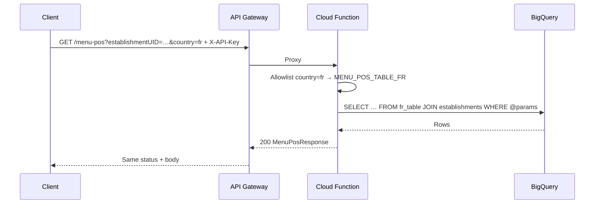
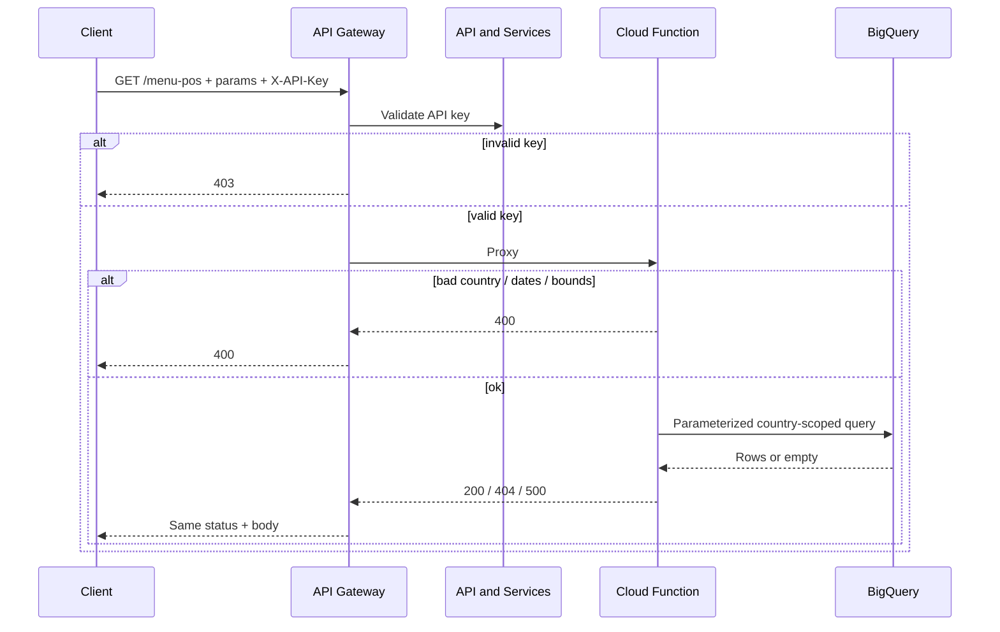

# Data flow: menu-engineering country-split

## Happy path

1. Client sends `GET /menu-pos?establishmentUID=EST-001&country=de&limit=50` to `GATEWAY_HOST` with header `X-API-Key: YOUR_API_KEY`.
2. API Gateway validates the key. Missing / invalid → **403** at the edge (no function hop).
3. Gateway proxies to the Cloud Function `x-google-backend` address.
4. Handler validates country against the allowlist, resolves the table map, runs a parameterized BigQuery job with `LIMIT`/`OFFSET`, returns `{records, count}`.
5. Gateway returns that status and body to the client.

## Country branch



Unsupported `country` values stop in the handler with **400** — no warehouse round trip. Do not silently fall back to DE; that hides client bugs and pollutes country metrics.

## Date window and paging

Dates are ISO `YYYY-MM-DD`. Omitting them uses wide defaults (`1900-01-01` … `2099-12-31`) so a simple establishment lookup still works. Cap `limit` at 1000 in both OpenAPI and the handler.

```mermaid
flowchart TD
  start[Start offset=0]
  call[GET /menu-pos with establishment + country + limit]
  write[Consume records]
  check{count == limit?}
  next[offset = offset + limit]
  done[Stop or stop on 404]

  start --> call --> write --> check
  check -->|likely more| next --> call
  check -->|short page| done
```

Treat a **404** (no rows for establishment / window) as empty result for that lookup, not as a transport failure.

## Failure modes

| Symptom | Likely cause | What to check |
|---------|--------------|---------------|
| 403 at gateway | Bad / missing `X-API-Key` | Key restriction, header name, enabled APIs |
| 403 from function | Invoker IAM | Gateway SA invoker on the function |
| 400 unsupported country | Typo / new country not deployed | Enum in OpenAPI vs `MENU_POS_TABLE_*` map |
| 400 on dates / paging | Non-ISO date or out-of-range limit | Pattern in OpenAPI; handler caps |
| 404 empty | Wrong establishment, window, or country table | Table map env; join product code |
| 500 from BQ | Table / IAM / type mismatch | Runtime SA roles; DATE params; keep detail gated |

## Logging and privacy

- Do not log full API keys.
- Log country + paging dimensions; avoid logging raw establishment ids when they are customer-sensitive.
- Sold-item payloads include item names and prices — treat retention like other POS extracts.
- Correlate gateway request logs with function logs when only one country fails (usually a table-map / IAM miss).

## Generic sequence


