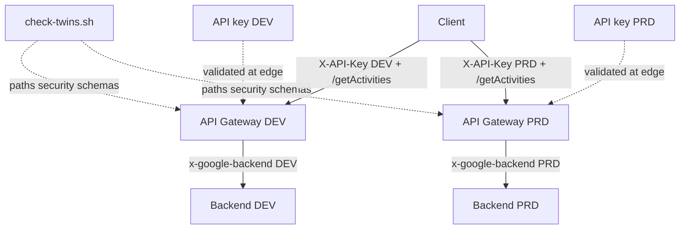
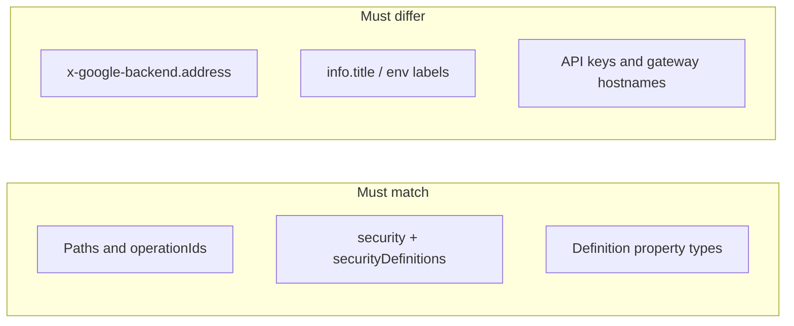

# Architecture: DEV vs PRD API Gateway twins

## Components

| Component | Role |
|-----------|------|
| Partner / internal client | Calls the same path against DEV or PRD hostname |
| API Gateway (DEV) | Serves `openapi.dev.yaml`; validates DEV API key |
| API Gateway (PRD) | Serves `openapi.prd.yaml`; validates PRD API key |
| API keys (API & Services) | Separate keys per env; restrict each to its API |
| Cloud Function / Cloud Run (DEV) | Dev warehouse / dataset |
| Cloud Function / Cloud Run (PRD) | Prod warehouse / dataset |
| `check-twins.sh` | Local / CI gate before config create |

## Diagram

## What must match vs what must differ

## IAM checklist

- Each gateway SA needs invoker on **its** env backend only — do not grant the PRD gateway SA invoker on the DEV function "for convenience," and never the reverse.
- Prefer denying public invoker on both backends.
- Restrict each API key to its API / gateway in API & Services.
- Runtime SA on each backend needs warehouse access for that env's datasets — separate from the gateway SA.

## Environment separation

- Separate GCP projects (or at least separate gateway + function names) for DEV and PRD.
- New OpenAPI revision → new `CONFIG_ID`. Never overwrite; never reuse a PRD config id in DEV.
- Keep `openapi.*.yaml` in the same folder so reviewers see twin diffs in one PR.
- Run `check-twins.sh` in CI on every change to either file.

## Footguns this architecture avoids

1. **Security drop in DEV** — `securityDefinitions` present, path `security:` missing → unauthenticated gateway in the env people test against.
2. **Backend name drift undocumented** — function renamed in one env only; twin files make the intentional rename visible.
3. **Schema type drift** — int vs string on the same field across twins; gate fails until aligned.
4. **Config promotion mistakes** — deploying the PRD OpenAPI into the DEV project (wrong backend URL baked in).
