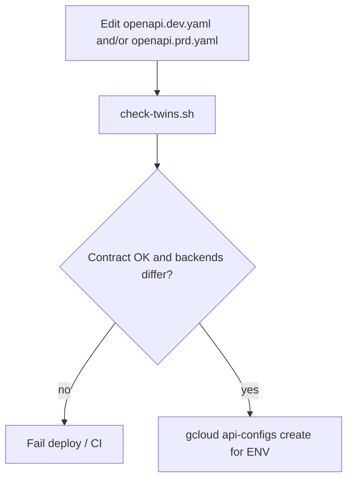
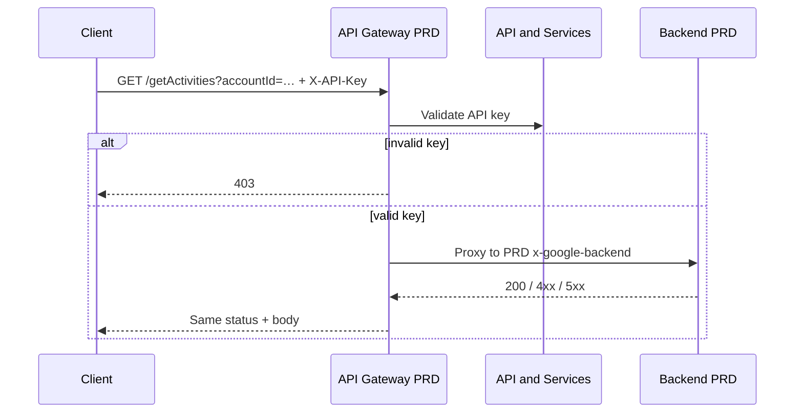

# Data flow: DEV vs PRD gateway twins

## Happy path (either env)

1. Client picks the env hostname (`GATEWAY_HOST` or `GATEWAY_HOST_DEV`) and the matching API key.
2. Client sends `GET /getActivities?accountId=ACC-001` with header `X-API-Key`.
3. That env's API Gateway validates the key. Missing / invalid → **403** at the edge.
4. Gateway proxies to the env-specific `x-google-backend` Cloud Function / Cloud Run URL.
5. Backend returns activity rows (or 4xx/5xx). Gateway forwards status + body.

The path and header name are identical in both twins — only the host, key, and backend differ.

## Twin gate before deploy

Run the gate locally before `deploy.sh`, and again in CI. The script is intentionally narrow: paths, operationIds, path-level security, securityDefinitions name/`in`, and definition property types. It is not a full OpenAPI linter.

## Sequence (PRD)

DEV is the same sequence against the DEV gateway, DEV key, and DEV backend.

## Failure modes

| Symptom | Likely cause | What to check |
|---------|--------------|---------------|
| 403 in PRD, 200 in DEV without a key | DEV twin dropped path `security:` | Diff twins; `check-twins.sh` security count |
| Works in DEV, 403 in PRD with "same" key | Shared / wrong key; key restricted to wrong API | Separate keys; API & Services restrictions |
| Works in DEV, 404 / empty in PRD | Pointing at wrong backend or empty prod dataset | `x-google-backend.address` per twin |
| Client type errors after switching env | Schema type drift between twins | Definition prop types in `check-twins.sh` |
| `check-twins` fails identical backends | Copied one file over the other | Restore env-specific addresses |
| Gateway create succeeds, invoker fails | SA missing roles on that env's function | Per-env invoker IAM |

## Logging and privacy

- Do not log full API keys.
- Account identifiers may be customer-sensitive — prefer hashed or truncated forms in application logs.
- Correlate gateway request logs with the matching env's backend logs; cross-env log hunting usually means the wrong twin was deployed.

## Related twin footgun (customer-lookup)

A sibling pair in source (`customer-lookup-co.yml` vs `…-dev.yml`) kept `securityDefinitions` in both files but removed the path-level `security:` block in DEV. That is exactly what `check-twins.sh` is meant to catch. This pattern's exemplar keeps security on in both twins on purpose.
