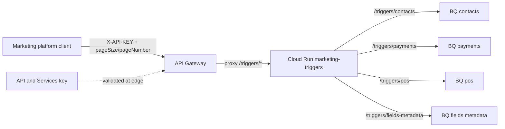
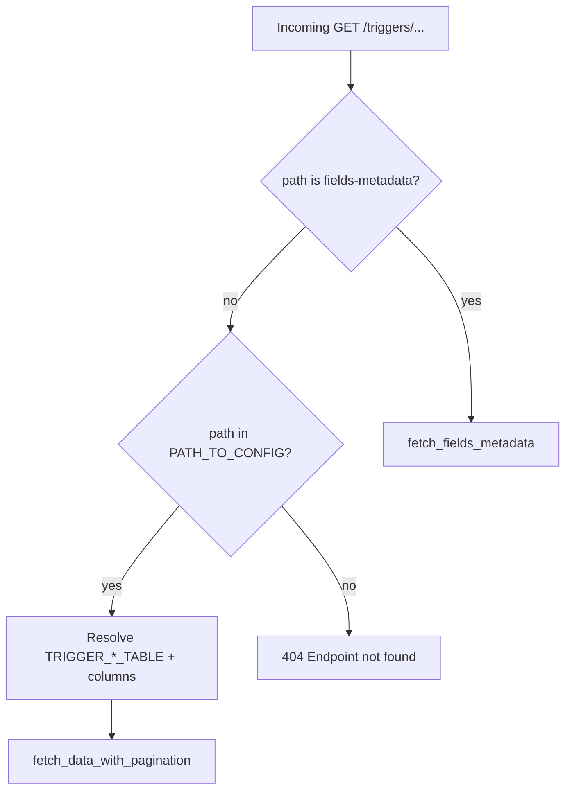

# Architecture: multi-table marketing-trigger via API Gateway

## Components

| Component | Role |
|-----------|------|
| Marketing platform / partner client | Calls `/triggers/*` with `X-API-KEY` + paging |
| API Gateway | Validates key; proxies each path to the same Cloud Run service |
| API key (API & Services) | Credential restricted to this API / gateway |
| Cloud Run service | Path map → table config → shared paginated BQ read |
| BigQuery trigger tables | One table per product domain (contacts, payments, …) |
| BigQuery fields-mapping table | Source model / field → destination field + data type |

## Diagram



## Path → table selection

OpenAPI publishes the closed path set. The handler resolves path → config key → env table id. Callers never name warehouse objects.



## Shared pagination helper

```mermaid
flowchart LR
  cfg[table_config]
  val[Validate pageSize / pageNumber]
  q[SELECT cols LIMIT @page_size OFFSET @offset]
  c[COUNT(*) for totalPages]
  env["{records, pagination}"]

  cfg --> val --> q
  val --> c
  q --> env
  c --> env
```

## IAM checklist

- Gateway SA needs `roles/run.invoker` on the Cloud Run service.
- Prefer denying public invoker on Cloud Run; only the gateway SA should call it.
- Restrict the API key to this API in API & Services; rotate keys without redeploying the service.
- Runtime SA needs BigQuery job user + data viewer on every trigger dataset — not the gateway SA.
- Metadata table IAM is easy to forget when you only tested `/triggers/contacts`.

## Environment separation

- Dev vs prod: different `x-google-backend.address` hosts and different `TRIGGER_*_TABLE` values.
- Prefer Secret Manager / `--set-secrets` for table ids; avoid baking project ids into the image.
- Keep `EXPOSE_ERROR_DETAIL=false` in prod.
- When adding a seventh product path: update OpenAPI + `PATH_TO_CONFIG` + env var in the same change set (same discipline as pattern 11 twin checks, just path-level).

## Why include the handler here

Gateway YAML shows seven paths with identical paging params. The production risk is how the backend turns path into SQL without copy-paste drift. Shipping `main.py` makes the path map, shared paginator, and metadata grouping visible in one folder.
