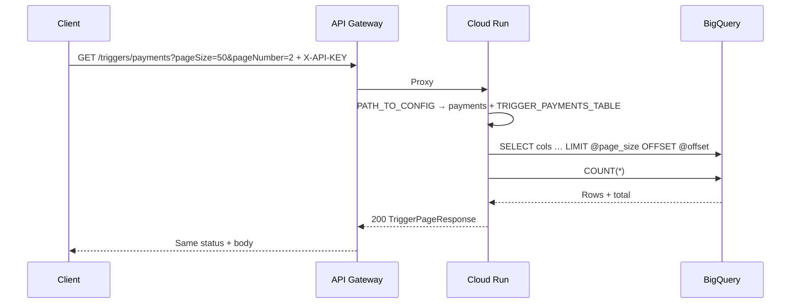
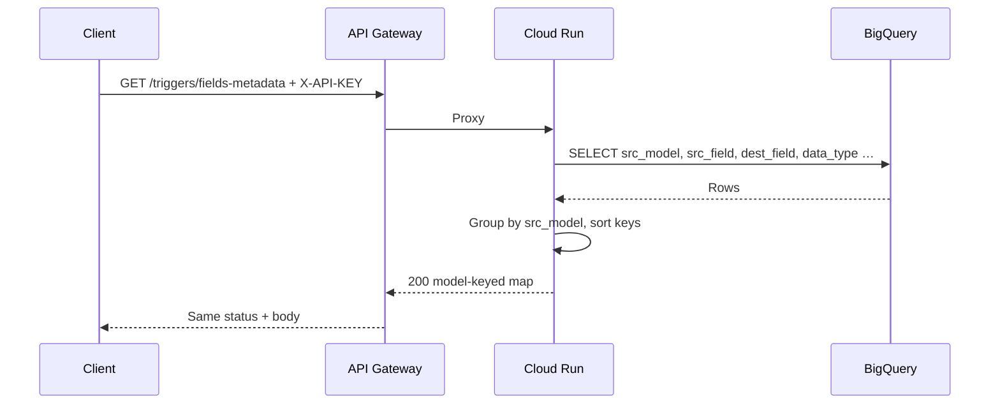
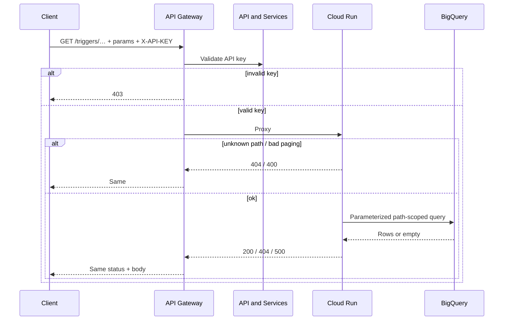

# Data flow: multi-table marketing-trigger extracts

## Happy path (paginated extract)

1. Client sends `GET /triggers/contacts?pageSize=100&pageNumber=1` to `GATEWAY_HOST` with header `X-API-KEY: YOUR_API_KEY`.
2. API Gateway validates the key. Missing / invalid → **403** at the edge (no Cloud Run hop).
3. Gateway proxies to Cloud Run `x-google-backend` address for that path.
4. Handler maps path → `contacts` config, resolves `TRIGGER_CONTACTS_TABLE`, runs shared paginated BigQuery read, returns `{records, pagination}`.
5. Gateway returns that status and body to the client.

## Path branch



Unknown paths stop with **404 Endpoint not found** — no warehouse round trip.

## Fields-metadata path



Empty metadata → **404**. No `pageSize` / `pageNumber` on this path.

## Client paging loop

```mermaid
flowchart TD
  start[pageNumber = 1]
  call[GET /triggers/…?pageSize=N&pageNumber=P]
  write[Consume records]
  check{pageNumber < totalPages?}
  next[pageNumber += 1]
  done[Stop or stop on 404]

  start --> call --> write --> check
  check -->|yes| next --> call
  check -->|no| done
```

Treat a **404** (empty page) as end-of-data for that path, not as a transport failure — unless page 1 is empty and you expected rows (then check table env / IAM).

## Failure modes

| Symptom | Likely cause | What to check |
|---------|--------------|---------------|
| 403 at gateway | Bad / missing `X-API-KEY` | Key restriction, header name (`X-API-KEY`), enabled APIs |
| 403 from Cloud Run | Invoker IAM | Gateway SA `roles/run.invoker` |
| 404 Endpoint not found | Typo / undeployed path | OpenAPI paths vs `PATH_TO_CONFIG` |
| 400 on paging | pageSize/pageNumber < 1 or pageSize > 10000 | OpenAPI max + handler caps |
| 404 No data found | Empty table or page past end | Table env; `total` from a known good page |
| 404 No mapping fields | Empty metadata table | `TRIGGER_FIELDS_METADATA_TABLE` |
| 500 from BQ | Table / IAM / column mismatch | Runtime SA; column list vs warehouse; keep detail gated |

## Logging and privacy

- Do not log full API keys.
- Log path + paging dimensions; avoid logging raw emails / phone fields from contact extracts.
- Marketing trigger payloads often include consent flags and establishment identifiers — treat retention like other CRM extracts.
- Correlate gateway request logs with Cloud Run logs when only one path fails (usually a missing `TRIGGER_*_TABLE` or dataset IAM miss).

## Generic sequence


