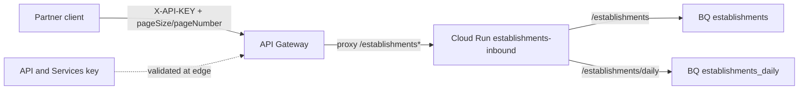
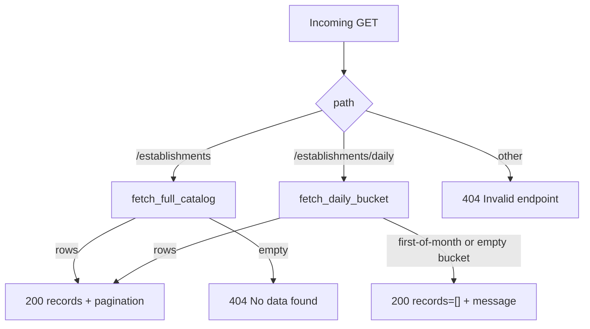
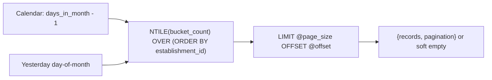

# Architecture: inbound dual-route daily NTILE via API Gateway

## Components

| Component | Role |
|-----------|------|
| Partner / destination client | Calls `/establishments` or `/establishments/daily` with `X-API-KEY` + paging |
| API Gateway | Validates key; proxies each path to the same Cloud Run service |
| API key (API & Services) | Credential restricted to this API / gateway |
| Cloud Run service | Path branch → full catalog or daily NTILE BQ read |
| BigQuery catalog table | Full refined establishment snapshot |
| BigQuery daily table | Source for NTILE day-of-month buckets |

## Diagram

## Path branch and empty semantics

## Daily NTILE selection

Bucket count is `days_in_month - 1`. Bucket index is yesterday's day-of-month. First calendar day short-circuits to soft empty before querying — the daily pipeline is often idle then.

## IAM checklist

- Gateway SA needs `roles/run.invoker` on the Cloud Run service.
- Prefer denying public invoker on Cloud Run; only the gateway SA should call it.
- Restrict the API key to this API in API & Services; rotate keys without redeploying the service.
- Runtime SA needs BigQuery job user + data viewer on **both** catalog and daily datasets — easy to grant only one and break a single path.

## Environment separation

- Dev vs prod: different `x-google-backend.address` hosts and different `ESTABLISHMENTS_*_TABLE` values.
- Prefer Secret Manager / `--set-secrets` for table ids; avoid baking project ids into the image.
- Keep `EXPOSE_ERROR_DETAIL=false` in prod.
- When renaming paths: update OpenAPI + handler route checks in the same change set.

## Why include the handler here

Gateway YAML shows two nearly identical paging contracts. The production risk is the **asymmetric empty semantics** and the NTILE calendar math. Shipping `main.py` makes those choices visible next to the OpenAPI, not buried in a private Functions repo.
