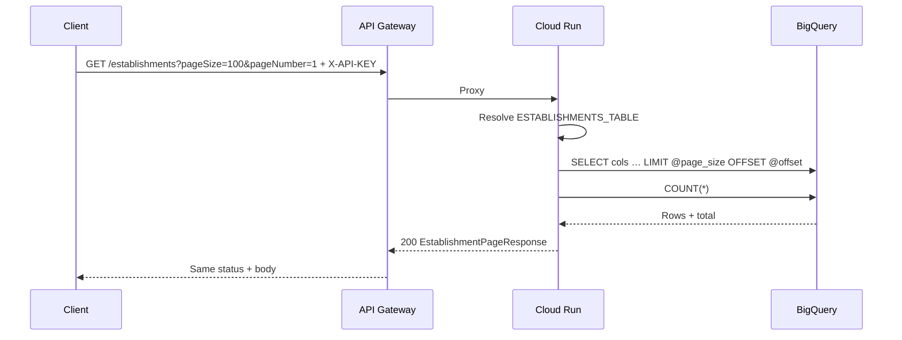
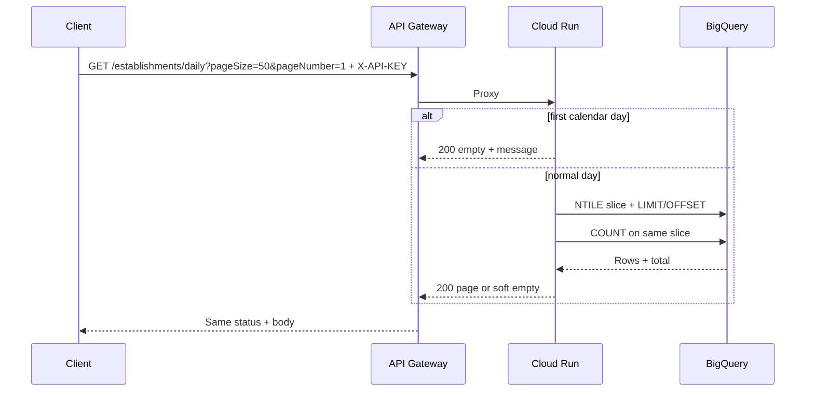

# Data flow: inbound dual-route daily NTILE extracts

## Happy path (full catalog)

1. Client sends `GET /establishments?pageSize=100&pageNumber=1` to `GATEWAY_HOST` with header `X-API-KEY: YOUR_API_KEY`.
2. API Gateway validates the key. Missing / invalid → **403** at the edge (no Cloud Run hop).
3. Gateway proxies to Cloud Run `x-google-backend` address for `/establishments`.
4. Handler resolves `ESTABLISHMENTS_TABLE`, runs parameterized `LIMIT/OFFSET` + `COUNT`, returns `{records, pagination}`.
5. Gateway returns that status and body to the client.



Empty page on this path → **404** No data found.

## Happy path (daily NTILE)

1. Client sends `GET /establishments/daily?pageSize=100&pageNumber=1` with the same key.
2. Gateway proxies to the daily backend address.
3. Handler computes `bucket_count = days_in_month - 1` and `bucket_index = yesterday.day`.
4. If today is the first calendar day → immediate soft empty (no BQ hop).
5. Otherwise query daily table with `QUALIFY NTILE(@bucket_count) … = @bucket_index`, then page.
6. Empty bucket → **200** with `records: []`, `message: "No new data got updated"`, zeroed pagination.



## Client paging loop (full catalog)

```mermaid
flowchart TD
  start[pageNumber = 1]
  call[GET /establishments?pageSize=N&pageNumber=P]
  write[Consume records]
  check{pageNumber < totalPages?}
  next[pageNumber += 1]
  done[Stop on last page or 404]

  start --> call --> write --> check
  check -->|yes| next --> call
  check -->|no| done
```

Treat **404** on the full path as end-of-data (or misconfigured empty table if page 1 fails). Treat soft empty on the **daily** path as a successful quiet day — do not retry as transport failure.

## Failure modes

| Symptom | Likely cause | What to check |
|---------|--------------|---------------|
| 403 at gateway | Bad / missing `X-API-KEY` | Key restriction, header name, enabled APIs |
| 403 from Cloud Run | Invoker IAM | Gateway SA `roles/run.invoker` |
| 404 Invalid endpoint | Typo / undeployed path | OpenAPI paths vs handler route checks |
| 400 on paging | pageSize/pageNumber < 1 or pageSize > 1000 | OpenAPI max + handler caps |
| 404 No data found (full) | Empty table or page past end | `ESTABLISHMENTS_TABLE`; `total` from a known good page |
| 200 empty + message (daily) | Quiet bucket or first-of-month | Expected; verify day and daily table only if always empty |
| 500 from BQ | Table / IAM / column mismatch | Runtime SA on both tables; `places_legacy_id` vs warehouse name; keep detail gated |

## Operability notes

- New OpenAPI revision requires a **new** API Gateway config id — do not overwrite in place.
- Log bucket_count / bucket_index at INFO when debugging uneven month-end slices; do not log full SQL with secrets.
- Prefer Secret Manager for table ids; rotate without rebuilding the image.
- Align OpenAPI and handler max pageSize in the same change set.
