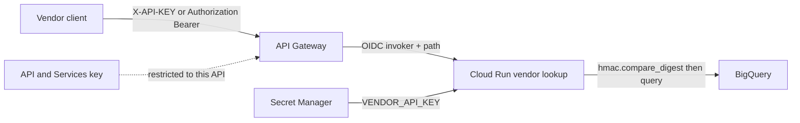
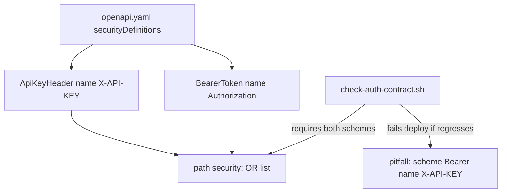
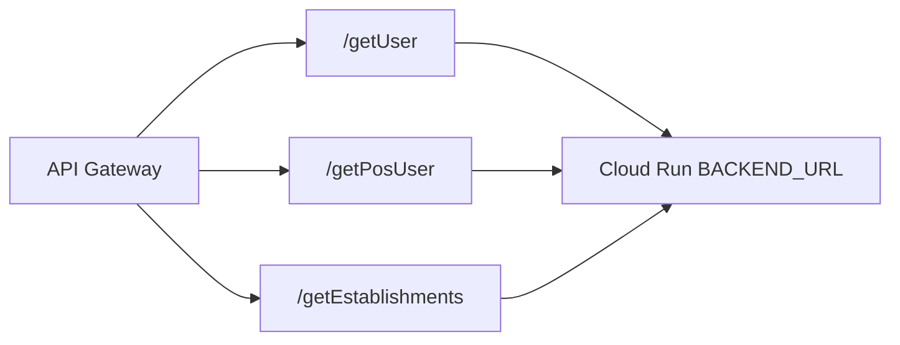

# Architecture: dual-scheme gateway auth in front of Cloud Run

## Components

| Component | Role |
|-----------|------|
| Vendor / partner client | Sends `X-API-KEY` **or** `Authorization: Bearer …` |
| API Gateway | Validates declared apiKey schemes; proxies path to Cloud Run |
| API & Services key | Platform credential restricted to this API (see keys pattern) |
| Cloud Run vendor lookup | Path route + app-layer shared-secret check (pattern 06) |
| Secret Manager | Source of truth for `VENDOR_API_KEY` |
| BigQuery | Parameterized reads for users / POS users / establishments |

## Edge vs app auth

Gateway rejection and handler rejection are different failure domains. A request can pass the edge key check and still fail app-layer compare if the shared secret rotated only on one side — treat that as a rotation bug, not "gateway is broken."

## Dual scheme contract

Swagger 2.0: a `security` array of objects is OR. A single object with multiple scheme keys is AND. This pattern uses OR so either header works.

## Path backends

Each `x-google-backend.address` includes the path suffix and `protocol: h2`. That matches how Cloud Run expects the function/service to see `/getUser` etc. after gateway proxying.

## IAM checklist

- Gateway SA: `roles/run.invoker` on the Cloud Run service.
- Prefer `--no-allow-unauthenticated` on Cloud Run.
- Restrict the API & Services key to this API; rotate without redeploying the service.
- Runtime SA: BigQuery job user + data viewer on the vendor tables only.
- Never put `YOUR_API_KEY` into OpenAPI examples as a real value.

## Environment separation

Dev and prod differ by project, gateway host, backend URL, and secret version. Keep one OpenAPI shape; substitute hosts per env (or twin files if you adopt pattern 11). Do not fork security scheme names between envs — that is how the Bearer/X-API-KEY confusion returns.
