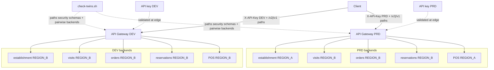
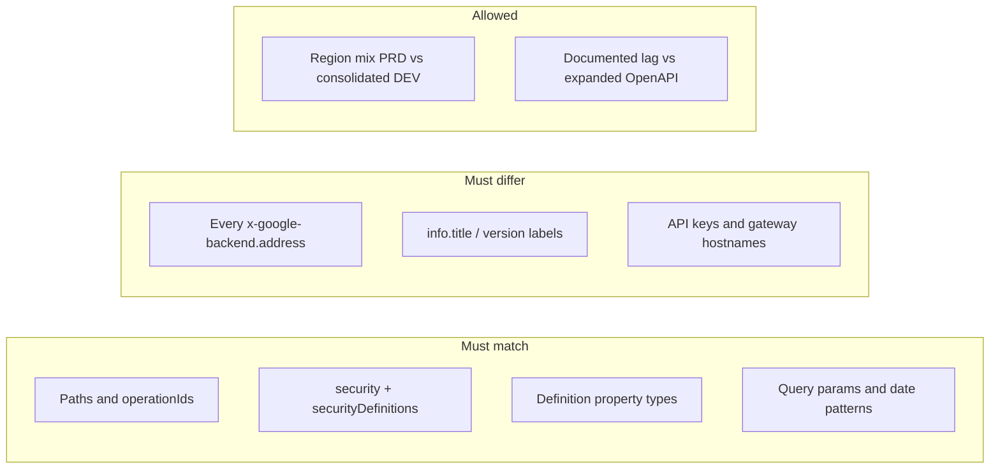

# Architecture: Multi-route panel dashboard gateway twins

## Components

| Component | Role |
|-----------|------|
| Partner / internal client | Calls the same paths against DEV or PRD hostname |
| API Gateway (DEV) | Serves `openapi.dev.yaml`; validates DEV API key |
| API Gateway (PRD) | Serves `openapi.prd.yaml`; validates PRD API key |
| API keys (API & Services) | Separate keys per env; restrict each to its API |
| Panel Cloud Functions (×5 per env) | Establishment, visits, orders, reservations, POS |
| `check-twins.sh` | Local / CI gate before config create |

## Diagram

## What must match vs what must differ

## IAM checklist

- Each gateway SA needs invoker on **all five** backends for its env — not just establishment.
- Do not grant the PRD gateway SA invoker on DEV functions "for convenience," and never the reverse.
- Prefer denying public invoker on every backend.
- Restrict each API key to its API / gateway in API & Services.
- Runtime SA on each backend needs warehouse access for that env's datasets — separate from the gateway SA.

## Environment separation

- Separate GCP projects (or at least separate gateway + function names) for DEV and PRD.
- New OpenAPI revision → new `CONFIG_ID`. Never overwrite; never reuse a PRD config id in DEV.
- Keep both twin files in the same folder so reviewers see multi-route diffs in one PR.
- Run `check-twins.sh` in CI on every change to either file.
- When adding a route (for example `/v3/getPOS`), update **both** twins and extend invoker grants before deploy.

## Footguns this architecture avoids

1. **Single-route env leak** — four DEV backends correct, one still PRD; pairwise check fails.
2. **Security drop in DEV** — `securityDefinitions` present, path `security:` missing on some routes.
3. **Duplicate backends within an env** — two paths accidentally share one function URL.
4. **Twin lag without documentation** — PRD-only `/v3` expansion while DEV twin stays at five routes.
5. **Partial invoker grants** — gateway 200 on establishment, 403/500 on POS; looks like "POS is broken" not IAM.
