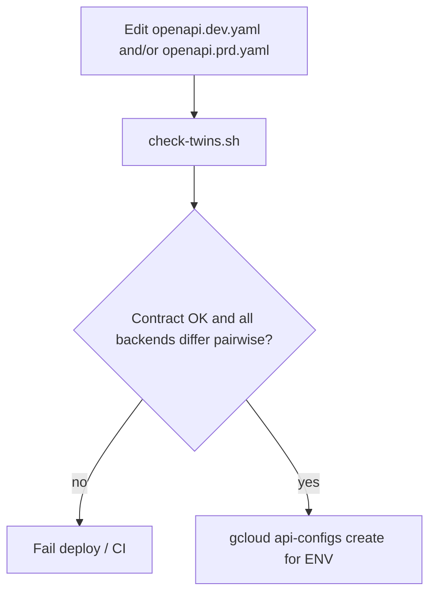
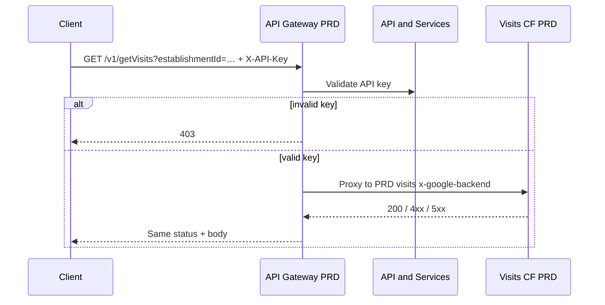

# Data flow: Multi-route panel dashboard gateway twins

## Happy path (either env)

1. Client picks the env hostname (`GATEWAY_HOST` or `GATEWAY_HOST_DEV`) and the matching API key.
2. Client sends one of the five GETs, for example `GET /v1/getVisits?establishmentId=EST-001&limit=20` with header `X-API-Key`.
3. That env's API Gateway validates the key. Missing / invalid → **403** at the edge.
4. Gateway proxies to the **path-specific** `x-google-backend` Cloud Function for that env.
5. Backend returns rows (or 4xx/5xx). Gateway forwards status + body.

Paths and header name are identical in both twins — only the host, key, and per-route backend differ.

## Twin gate before deploy

The multi-route gate checks:

- Path keys and operationIds match
- Path-level security block count and contents match
- `securityDefinitions` name / `in` match
- Definition property types match
- Backend count equals path count
- **Each** PRD backend differs from the DEV backend at the same path index
- No duplicate backends within a single twin

Region differences (PRD `REGION_A` vs DEV `REGION_B` on the same logical function) are allowed.

## Sequence (PRD visits route)

Other paths follow the same sequence against their own Cloud Function. DEV is identical against the DEV gateway, DEV key, and DEV backends.

## Failure modes

| Symptom | Likely cause | What to check |
|---------|--------------|---------------|
| Visits return prod-looking data in DEV | `/v1/getVisits` still points at PRD URL | Pairwise backends in `check-twins.sh` |
| 403 in PRD, 200 in DEV without a key | DEV twin dropped path `security:` on some routes | Security block count |
| Establishment OK, POS 403/500 | Missing invoker on POS function only | Per-route IAM |
| Works in DEV, empty / 404 in PRD | Wrong backend or empty prod dataset | Path-specific `x-google-backend.address` |
| Client type errors after switching env | Schema type drift between twins | Definition prop types gate |
| DEV missing a route PRD has | Twin lag (e.g. `/v3` added to one file) | Path key diff in gate |
| `check-twins` fails identical backends | Copied one twin over the other | Restore env-specific addresses |

## Logging and privacy

- Do not log full API keys.
- Establishment identifiers may be customer-sensitive — prefer hashed or truncated forms in application logs.
- Correlate gateway request logs with the matching env **and** matching function; a visits failure should not send you into POS logs first.

## Twin lag vs expanded OpenAPI

Pattern 03's lineage (`dish_pos_openapi_spec.yml`) includes `/v3/getPOS`. This twin pair deliberately stays at five routes, matching the `hd-dish-panel-dashboard-*-gbq_v2.yml` pair. When you promote a sixth route, update both twins, extend `check-twins` expectations, and add the sixth invoker grant before clients depend on it.
