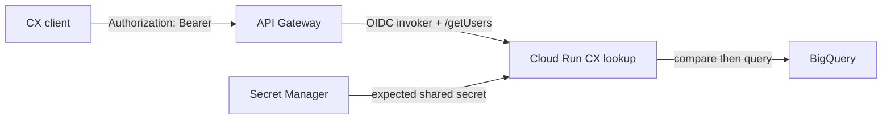
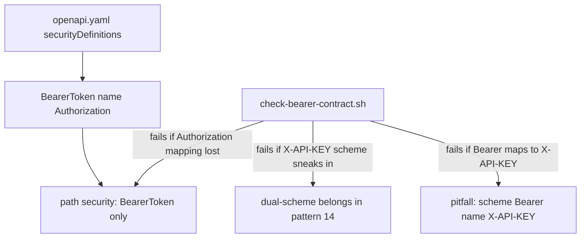
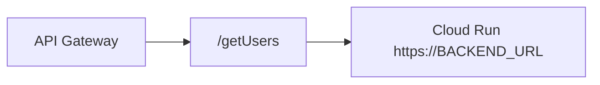

# Architecture: Bearer-only gateway auth in front of Cloud Run

## Components

| Component | Role |
|-----------|------|
| CX / partner client | Sends `Authorization: Bearer YOUR_API_KEY` |
| API Gateway | Validates the BearerToken apiKey scheme; proxies path to Cloud Run |
| Shared secret / API & Services key | Credential restricted to this API when using platform keys |
| Cloud Run CX user lookup | Path `/getUsers` + app-layer shared-secret check |
| Secret Manager | Source of truth for the expected Bearer token value |
| BigQuery (typical) | Parameterized user lookup by establishment_id |

## Edge auth (Bearer only)

Gateway rejection (missing/invalid platform binding) and handler rejection
(secret mismatch) are different failure domains. Do not collapse them into one
"401 means rotate everything" runbook.

## Scheme mapping (the point of this pattern)

Swagger 2.0 `apiKey` in `header` with `name: Authorization` is how API Gateway
expresses Bearer shared-secret auth. Keep the scheme **name** and the header
**name** aligned so Swagger UI and codegen do not lie.

## Path backend

`x-google-backend.address` includes the `/getUsers` path suffix and
`protocol: h2`. That matches how Cloud Run expects the service to see the path
after gateway proxying.

## IAM checklist

- Gateway SA: `roles/run.invoker` on the Cloud Run service.
- Prefer `--no-allow-unauthenticated` on Cloud Run.
- Restrict platform API keys to this API when you use API & Services keys as
  the Bearer material (or keep Bearer as a Secret Manager value and document
  distribution separately).
- Runtime SA: least privilege on the user table only.
- Never put real tokens into OpenAPI examples.

## Environment separation

Dev and prod differ by project, gateway host, backend URL, and secret version.
Keep one OpenAPI shape; substitute hosts per env (or twin files if you adopt
pattern 11). Do not fork the Bearer scheme name between envs — that is how
Authorization/X-API-KEY confusion returns.
