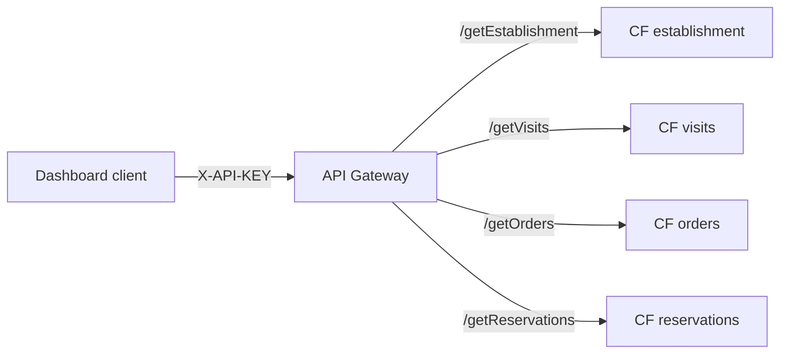
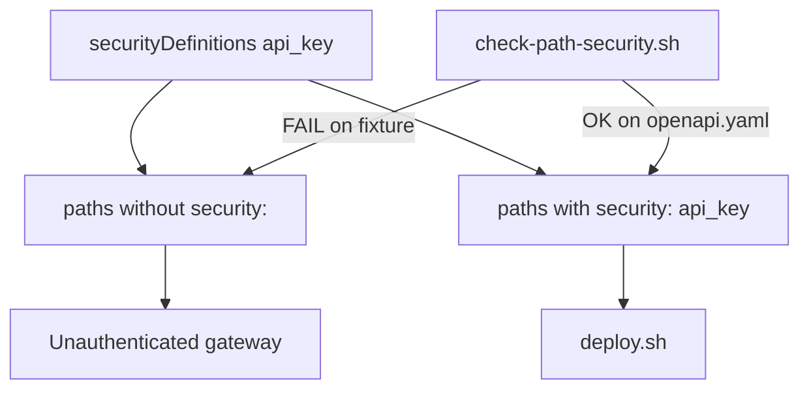
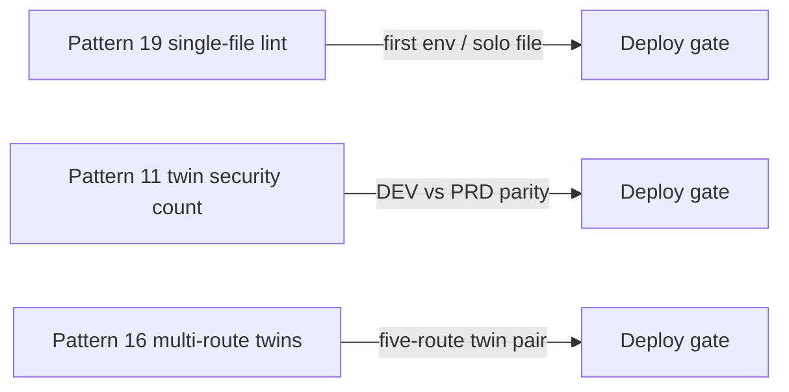

# Architecture: multi-route path-security enforcement

## Components

| Component | Role |
|-----------|------|
| Dashboard / partner client | Sends `X-API-KEY: YOUR_API_KEY` |
| API Gateway | Enforces path-level `api_key` on each route; proxies to Cloud Functions |
| Four Cloud Functions | Establishment / visits / orders / reservations backends |
| `check-path-security.sh` | Pre-deploy gate: definitions imply every operation has `security:` |
| API & Services key | Credential restricted to this API |
| BigQuery (typical) | Parameterized reads behind each function |

## Request path

Edge auth is one decision applied four times. A missing `security:` on a single
path leaves that backend open while the others look protected.

## The footgun vs the gate

Swagger 2.0 `securityDefinitions` alone never bind to requests. Path-level
`security:` (or a document-level `security:`) is what API Gateway evaluates.

## Relation to twin checks

Use this lint when you have one OpenAPI. Add pattern 11 / 16 once twins exist.
Do not drop this check after twins appear — a solo PR that only edits one env
still needs the single-file rule.

## IAM checklist

- Gateway SA: invoker on **each** function (four grants, not one).
- Prefer `--no-allow-unauthenticated` on the functions.
- Restrict platform API keys to this API (see pattern 05).
- Runtime SA: least privilege on the tables each function reads.
- Never put real keys into OpenAPI examples or the negative fixture.

## Environment separation

Dev and prod differ by project, gateway host, and backend URLs. Keep path
`security:` identical across envs. Prefer header `X-API-KEY` in both; do not
"temporarily" switch DEV to query `key` for curl convenience.
