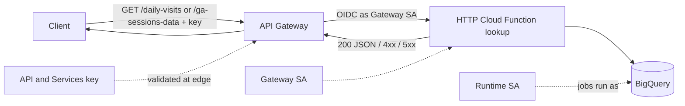
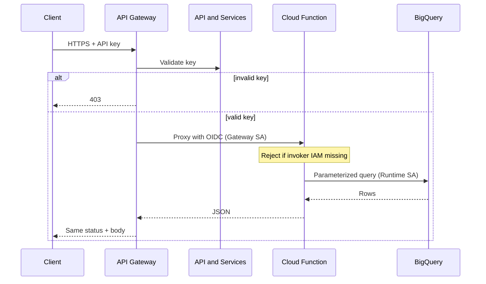

# Architecture: HTTP handler behind API Gateway

## Components

| Component | Role |
|-----------|------|
| Client / dashboard | Calls HTTPS on the gateway hostname only |
| API Gateway | API-key auth, OpenAPI routes, OIDC to backend |
| Gateway service account | Identity used for backend auth (`x-google-backend`) |
| HTTP Cloud Function (Gen2) | `lookup` entry point; route + query + JSON response |
| Runtime service account | Function identity for BigQuery jobs |
| BigQuery | Analytics source (public sample stand-in here) |

## Diagram

## Auth between gateway and function

Edge auth (API key) and backend auth (IAM) are different controls:

### IAM checklist

1. Deploy function with `--no-allow-unauthenticated`.
2. Grant the **gateway config service account**:
   - `roles/cloudfunctions.invoker` on the function
   - `roles/run.invoker` on the underlying Cloud Run service (Gen2)
3. Grant the **runtime service account** least privilege on BigQuery (e.g. job user + data viewer on the dataset).
4. Point OpenAPI `x-google-backend.address` at the function/Cloud Run URI; set `jwt_audience` if your gateway config requires it for Gen2.

If the gateway returns 200-path 403s from the backend, the key is fine — invoker IAM is not.

## Path forwarding

API Gateway may call a single backend URL for multiple OpenAPI paths. The function should not rely only on `request.path`. This handler checks, in order:

1. Explicit path markers in `request.path`, `X-Forwarded-Path`, `X-Envoy-Original-Path`, `X-Original-URI`
2. Query-shape heuristics (`start_date` / `end_date` vs `country` / `device_category` / `date`)
3. Default route (`ga-sessions`) for backward compatibility

Prefer fixing the OpenAPI so each path’s `x-google-backend.address` includes the path suffix when the platform supports it; keep header-based detection as a safety net.

## Environment separation

| Concern | Dev | Prod |
|---------|-----|------|
| `PROJECT_ID` | Dev billing project | Prod billing project |
| Gateway SA | Dev gateway SA | Prod gateway SA |
| Runtime SA | Dev function SA | Prod function SA |
| `CORS_ALLOW_ORIGIN` | Local / staging origin | Dashboard origin only |
| Backend address in OpenAPI | Dev function URI | Prod function URI |

Do not bake project IDs into the Python module — only into deploy env and per-env OpenAPI.
