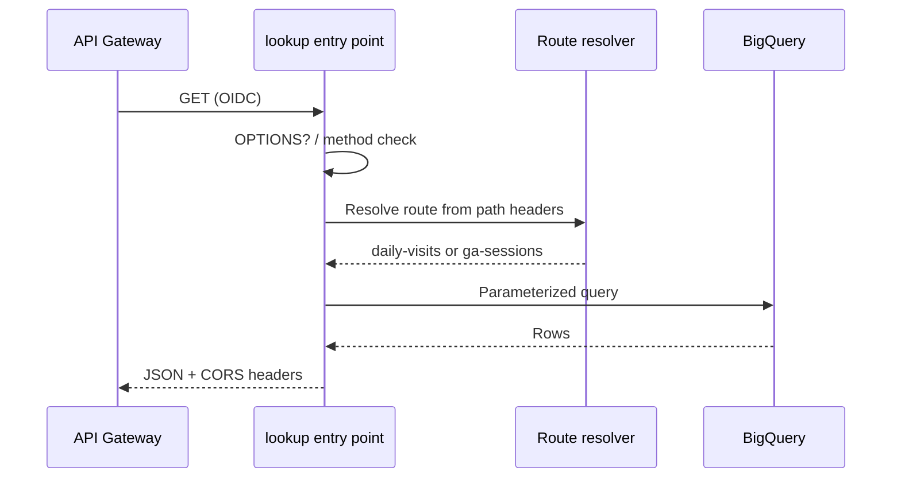

# Data flow: HTTP handler behind gateway

## Happy path

1. Client calls `GET https://GATEWAY_HOST/daily-visits?page=1&limit=50&key=YOUR_API_KEY` (or `/ga-sessions-data?...`).
2. API Gateway validates the API key. Missing/invalid → **403** at the edge.
3. Gateway proxies to the Cloud Function URI using the gateway service account (OIDC).
4. Function:
   - Handles `OPTIONS` for CORS preflight
   - Parses `page` / `limit` (cap 500)
   - Resolves route from forwarded path headers / query shape
   - Runs a parameterized BigQuery job as the runtime SA
   - Returns JSON with `records`, `pagination`, `filters_applied`, `metadata`
5. Gateway returns the same status and body to the client.

Example success body (daily-visits, truncated):

```json
{
  "records": [
    {"visit_date": "2017-08-01", "total_visits": 1234}
  ],
  "pagination": {
    "page": 1,
    "limit": 50,
    "total_records": 1,
    "total_pages": 1,
    "has_next": false,
    "has_previous": false
  },
  "filters_applied": {"start_date": null, "end_date": null},
  "metadata": {"records_returned": 1, "api_version": "1.0"}
}
```

## Failure modes

| Symptom | Likely cause | What to check |
|---------|--------------|---------------|
| 403 from gateway | Bad / missing API key | Key restriction, `key` query name |
| 403 from backend | Invoker IAM | Gateway SA has functions + run invoker |
| 400 | Bad page/limit/date/device | Query validation in handler |
| 404 | Empty result set | Filters / table date suffix |
| 500 | BQ permissions, bad table, uncaught error | Function logs (`request_failed`); runtime SA roles |
| Wrong route / default always | Path stripped by gateway | Forwarded-path headers; OpenAPI backend address path |
| CORS failure in browser | Origin not allowed | `CORS_ALLOW_ORIGIN` env |

## Logging

Structured lines look like:

```json
{"severity": "INFO", "message": "request_routed", "route": "daily-visits", "path": "/", "forwarded_path": "/daily-visits", "page": 1, "limit": 50}
```

Do not log API keys, Authorization headers, or full `request.headers` dumps in production handlers. The source demo had a `/debug` dump — intentionally omitted here.

## Sequence (function-local)


