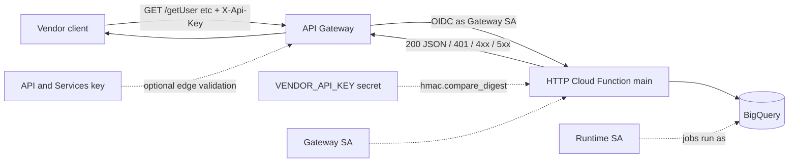
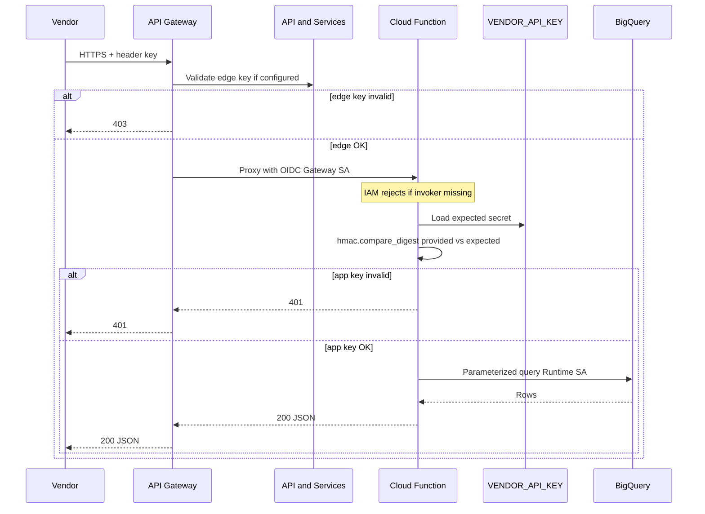

# Architecture: Vendor API key auth handler

## Components

| Component | Role |
|-----------|------|
| Vendor client | Calls HTTPS with `X-Api-Key` or Bearer token |
| API Gateway (optional but preferred) | Edge OpenAPI, optional second key / quota, OIDC to backend |
| Gateway service account | Invoker identity for Gen2 / Cloud Run |
| HTTP Cloud Function (`main`) | App-layer key check, route, query, JSON |
| Secret / env (`VENDOR_API_KEY`) | Expected shared secret (Secret Manager in prod) |
| Runtime service account | Identity for BigQuery jobs |
| BigQuery | Trusted mart / views for users, establishments, POS users |

## Diagram

## Auth layers

Edge auth, IAM, and application auth are independent controls:

### IAM + secret checklist

1. Deploy with `--no-allow-unauthenticated`.
2. Grant gateway SA `roles/cloudfunctions.invoker` and Gen2 `roles/run.invoker`.
3. Store `VENDOR_API_KEY` in Secret Manager; mount or inject at runtime. Avoid long-lived plaintext in deploy scripts.
4. Runtime SA: BigQuery job user + data viewer on the dataset only.
5. Rotate vendor keys with the partner on a schedule; invalidate old values by updating the secret, not by editing source.

## Path routing

Gateway OpenAPI in this pattern sets `x-google-backend.address` to `https://BACKEND_URL/getUser` (and siblings). The handler accepts exact path or suffix match so rewrites that preserve the leaf path still work.

If the gateway collapses everything to `/`, prefer fixing OpenAPI backend addresses rather than adding brittle query heuristics for vendor contracts.

## Environment separation

| Concern | Dev | Prod |
|---------|-----|------|
| `PROJECT_ID` / `DATASET_ID` | Dev warehouse | Prod warehouse |
| `VENDOR_API_KEY` | Dev partner key | Prod partner key |
| Gateway / runtime SAs | Dev identities | Prod identities |
| `CORS_ALLOW_ORIGIN` | Staging origin | Vendor / portal origin only |
| OpenAPI `BACKEND_URL` | Dev function URI | Prod function URI |

Do not bake project IDs, table names, or key values into the Python module.
