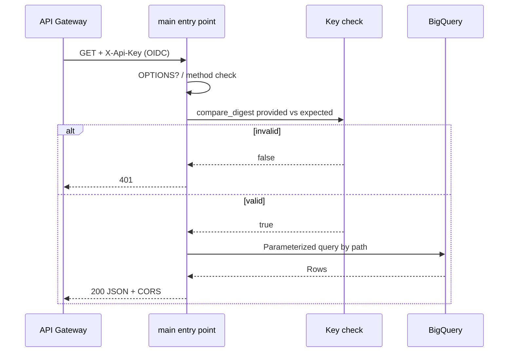

# Data flow: Vendor API key auth handler

## Happy path

1. Vendor calls `GET https://GATEWAY_HOST/getUser?account_id=ACCOUNT_ID` with header `X-Api-Key: YOUR_API_KEY` (or `Authorization: Bearer YOUR_API_KEY`).
2. API Gateway optionally validates an edge API key / quota, then proxies with OIDC as the gateway SA.
3. Function:
   - Handles CORS `OPTIONS`
   - Rejects non-GET with **405**
   - Loads expected secret from `VENDOR_API_KEY` (env) or local `.env`
   - Compares provided vs expected with `hmac.compare_digest`
   - Routes on path to users / establishments / POS-user query
   - Runs parameterized BigQuery as the runtime SA
   - Returns JSON keyed by the lookup id (vendor-friendly envelope)
4. Gateway returns the same status and body.

Example success body (`/getUser`, truncated / fake data):

```json
{
  "ACCOUNT_ID": [
    {
      "account_id": "ACCOUNT_ID",
      "establishment_id": "EST_ID",
      "salutation": "Ms",
      "first_name": "Ada",
      "last_name": "Example",
      "mobilephone": "+10000000000",
      "email": "user@example.com"
    }
  ]
}
```

## Failure modes

| Symptom | Likely cause | What to check |
|---------|--------------|---------------|
| 403 from gateway | Edge API key / restriction | API & Services key config |
| 403 from backend | Invoker IAM | Gateway SA functions + run invoker |
| 401 from handler | Missing/wrong `X-Api-Key` / Bearer | Secret value; header name; do not log the key |
| 401 with "not configured" logs | Empty `VENDOR_API_KEY` | Env / Secret Manager mount |
| 400 | Missing query params | `account_id` / `establishment_id` / `enterprise_id`+`country_code` |
| 404 path | Unknown route | OpenAPI path vs handler suffixes |
| 404 data | Empty BQ result | Filters, table env names, dataset |
| 500 | BQ permissions / bad table | Runtime SA roles; `query_failed` logs |
| CORS failure | Origin blocked | `CORS_ALLOW_ORIGIN` |

## Logging

Structured lines look like:

```json
{"severity": "INFO", "message": "request_accepted", "path": "/getUser"}
{"severity": "WARNING", "message": "auth_rejected", "path": "/getUser"}
```

Never log provided keys, Authorization headers, or full header dumps. Auth failures should record path only.

## Sequence (function-local)


