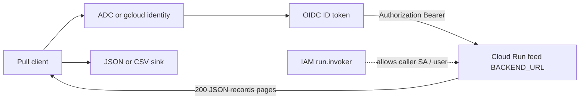
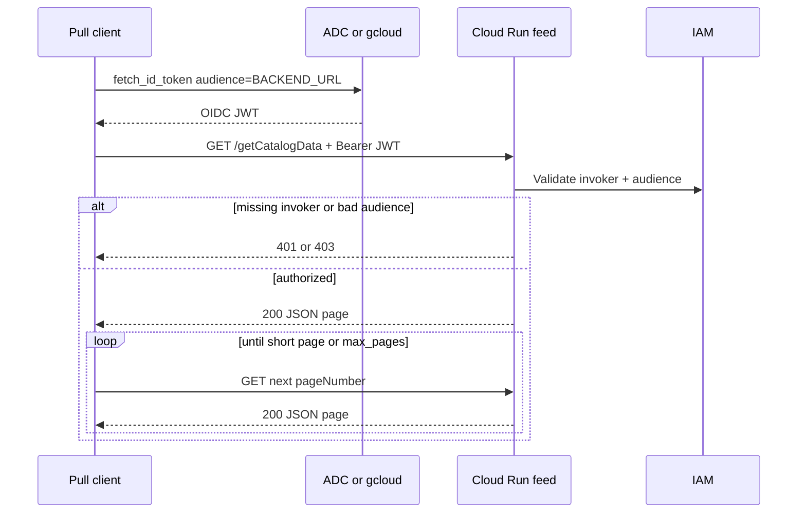
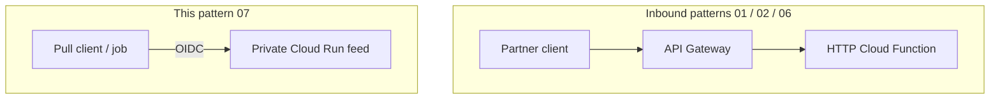

# Architecture: OIDC outbound HTTP client

## Components

| Component | Role |
|-----------|------|
| Pull client (`client.py`) | Obtains ID token, GETs pages, aggregates `records` |
| Caller identity | User ADC (laptop) or runtime SA (Cloud Run Job / Functions / GCE) |
| Target Cloud Run / Gen2 service | Private HTTPS feed; validates OIDC + IAM invoker |
| Invoker binding | `roles/run.invoker` (and Functions invoker if Gen2 CF) on caller → service |
| Optional sink | Local JSON / CSV for extracts; pipeline code can skip files and stream |

## Diagram

## Auth model

Cloud Run private services expect an ID token whose **audience** is the service URL (default) unless you configured a custom audience. Sending a Google access token (OAuth scope token) instead of an ID token is a common 401/403 footgun.

### IAM checklist

1. Target service deployed with `--no-allow-unauthenticated` (or equivalent IAM-only).
2. Grant the **caller** principal `roles/run.invoker` on that service (Gen2 CF: also `roles/cloudfunctions.invoker` when applicable).
3. Prefer a dedicated runtime SA for prod jobs — do not reuse human user credentials in scheduled pulls.
4. Keep `BACKEND_URL` per environment (dev vs prod). Wrong URL + broad invoker is how you scrape prod from a staging job.
5. Rotate by removing invoker members, not by rotating a shared password in git.

## Environment separation

| Concern | Dev | Prod |
|---------|-----|------|
| `BACKEND_URL` | Dev Cloud Run origin | Prod Cloud Run origin |
| Caller SA | Dev job SA | Prod job SA |
| Invoker binding | Dev SA → dev service | Prod SA → prod service |
| `--max-pages` / page size | Small samples | Full walk or bounded by SLA |

Do not bake project numbers, region hashes, or service names into the Python module.

## Relation to inbound patterns

Same platform pieces (Cloud Run, IAM, OIDC) — opposite arrow.
