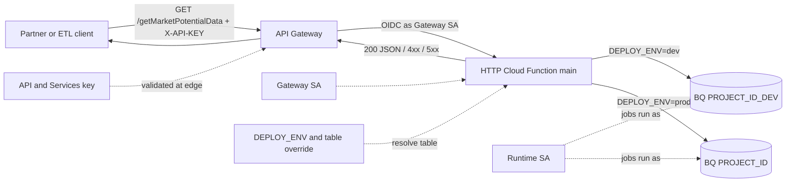
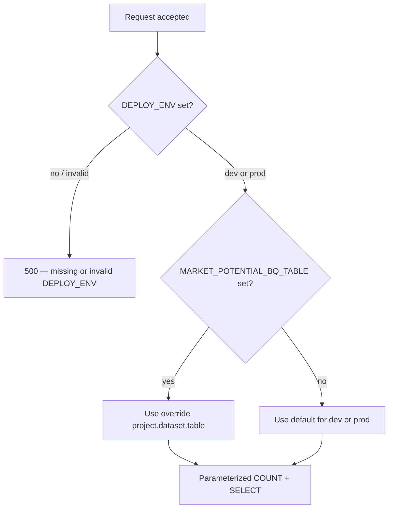

# Architecture: Env-scoped BigQuery pagination handler

## Components

| Component | Role |
|-----------|------|
| Partner / ETL client | Calls HTTPS with `X-API-KEY` + `countryCode` + pagination |
| API Gateway | Edge OpenAPI, API key validation, path proxy to backend |
| Gateway service account | Invoker identity for Gen2 / Cloud Run |
| HTTP Cloud Function (`main`) | Env resolve, validate, query, JSON |
| `DEPLOY_ENV` / table override | Selects which warehouse table the job reads |
| `EXPOSE_ERROR_DETAIL` | Gates whether 500 bodies include exception text |
| Runtime service account | Identity for BigQuery jobs |
| BigQuery | Dev or prod mart / view for market potential |

## Diagram

## Environment selection

### Env checklist

| Variable | Required | Notes |
|----------|----------|-------|
| `DEPLOY_ENV` | Yes | Exactly `dev` or `prod` (lowercase) |
| `MARKET_POTENTIAL_BQ_TABLE` | No | Full `project.dataset.table` override |
| `EXPOSE_ERROR_DETAIL` | No | `true` / `1` / `yes` only in non-prod |
| `CORS_ALLOW_ORIGIN` | Recommended | Explicit origin; avoid `*` in prod |

### IAM checklist

1. Deploy with `--no-allow-unauthenticated`.
2. Grant gateway SA `roles/cloudfunctions.invoker` and Gen2 `roles/run.invoker`.
3. Runtime SA: BigQuery job user + data viewer on the **target** dataset only (dev SA ≠ prod SA).
4. Restrict the edge API key to this API in API & Services.
5. Release gate: confirm `DEPLOY_ENV` and `EXPOSE_ERROR_DETAIL` on the Cloud Run revision before traffic.

## Why path backends

OpenAPI sets `x-google-backend.address` to `https://BACKEND_URL/getMarketPotentialData`. The handler accepts exact path or suffix match so gateway rewrites that preserve the leaf still work.

If you later split country extracts across services, update OpenAPI addresses and invoker grants per service — do not encode project IDs in the Python module.
