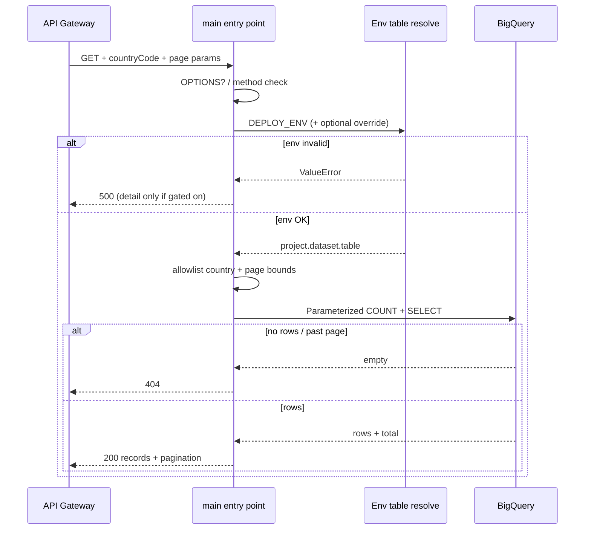

# Data flow: Env-scoped BigQuery pagination handler

## Happy path

1. Client calls `GET https://GATEWAY_HOST/getMarketPotentialData?countryCode=DE&pageSize=100&pageNumber=1` with header `X-API-KEY: YOUR_API_KEY`.
2. API Gateway validates the edge key, then proxies with OIDC as the gateway SA.
3. Function:
   - Handles CORS `OPTIONS`
   - Rejects non-GET with **405**
   - Resolves BQ table from `DEPLOY_ENV` (and optional override)
   - Normalizes country to uppercase; rejects values outside the allowlist with **400**
   - Runs parameterized `COUNT(*)` then `SELECT ... LIMIT/OFFSET`
   - Returns `{records, pagination}` on success
4. Gateway returns the same status and body.

Example success body (fake data):

```json
{
  "records": [
    {
      "country_code": "DE",
      "cust_no": "C10001",
      "home_store_id": "100",
      "annual_sale": 125000.0
    }
  ],
  "pagination": {
    "total": 1,
    "pageSize": 100,
    "pageNumber": 1,
    "totalPages": 1
  }
}
```

## Failure modes

| Symptom | Likely cause | What to check |
|---------|--------------|---------------|
| 403 from gateway | Edge API key / restriction | API & Services key config |
| 403 from backend | Invoker IAM | Gateway SA functions + run invoker |
| 400 country | Missing / not in allowlist | `countryCode` or `country_code`; enum DE,FR,ES,IT |
| 400 pagination | pageSize/pageNumber &lt; 1 or pageSize &gt; max | Client params; MAX_PAGE_SIZE=10000 |
| 404 path | Unknown route | OpenAPI path vs handler leaf |
| 404 data | Empty country or page past end | Filters; `total` from COUNT; pageNumber |
| 500 env | Missing/invalid `DEPLOY_ENV` | Cloud Run env on the revision |
| 500 BQ | Permissions / bad table / override typo | Runtime SA roles; logged resolved table |
| 500 with `detail` | `EXPOSE_ERROR_DETAIL` enabled | Expected in staging only |
| CORS failure | Origin blocked | `CORS_ALLOW_ORIGIN` |

## Logging

Log the resolved table and `DEPLOY_ENV` at resolve time. Log path on request failures. Never log API keys or full Authorization headers.

When `EXPOSE_ERROR_DETAIL` is off, 500 bodies stay generic (`Internal Server Error`) while Cloud Logging still gets `logger.exception`.

## Sequence (function-local)


