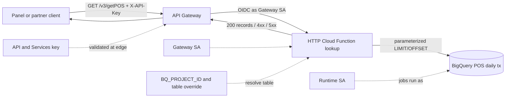
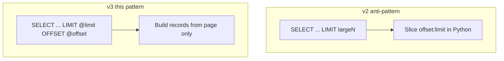

# Architecture: POS daily-transactions offset/limit handler

## Components

| Component | Role |
|-----------|------|
| Panel / partner client | Calls HTTPS with `X-API-Key` + `establishmentId` + paging |
| API Gateway | Edge OpenAPI, API key validation, path proxy to backend |
| Gateway service account | Invoker identity for Gen2 / Cloud Run |
| HTTP Cloud Function (`lookup`) | Validate, query, JSON `{records}` |
| `BQ_PROJECT_ID` / table override | Selects which warehouse table the job reads |
| `EXPOSE_ERROR_DETAIL` | Gates whether 500 bodies include exception text |
| Runtime service account | Identity for BigQuery jobs |
| BigQuery | Daily POS transactions mart / view |

## Diagram

## v2 vs v3 pagination

### Env checklist

| Variable | Required | Notes |
|----------|----------|-------|
| `BQ_PROJECT_ID` | Yes* | Job/billing project; required when table override unset |
| `DATASET_ID` | Recommended | Defaults to placeholder `DATASET_ID` if unset |
| `POS_DAILY_TX_TABLE` | No | Full `project.dataset.table` override |
| `POS_DAILY_TX_TABLE_ID` | No | Table leaf when building from project+dataset |
| `EXPOSE_ERROR_DETAIL` | No | `true` / `1` / `yes` only in non-prod |

\* Or set `POS_DAILY_TX_TABLE` alone.

### IAM checklist

1. Deploy with `--no-allow-unauthenticated`.
2. Grant gateway SA `roles/cloudfunctions.invoker` and Gen2 `roles/run.invoker`.
3. Runtime SA: BigQuery job user + data viewer on the POS daily transactions dataset only.
4. Restrict the edge API key to this API in API & Services.
5. Release gate: confirm `BQ_PROJECT_ID` / table override and `EXPOSE_ERROR_DETAIL` on the revision before traffic.

## Why SQL OFFSET here

Establishment histories are long-lived. Pushing `LIMIT`/`OFFSET` into BigQuery keeps billed bytes proportional to the page. Prefer a date-range filter later if deep OFFSET pages become a cost problem — that is a separate contract change for clients.
