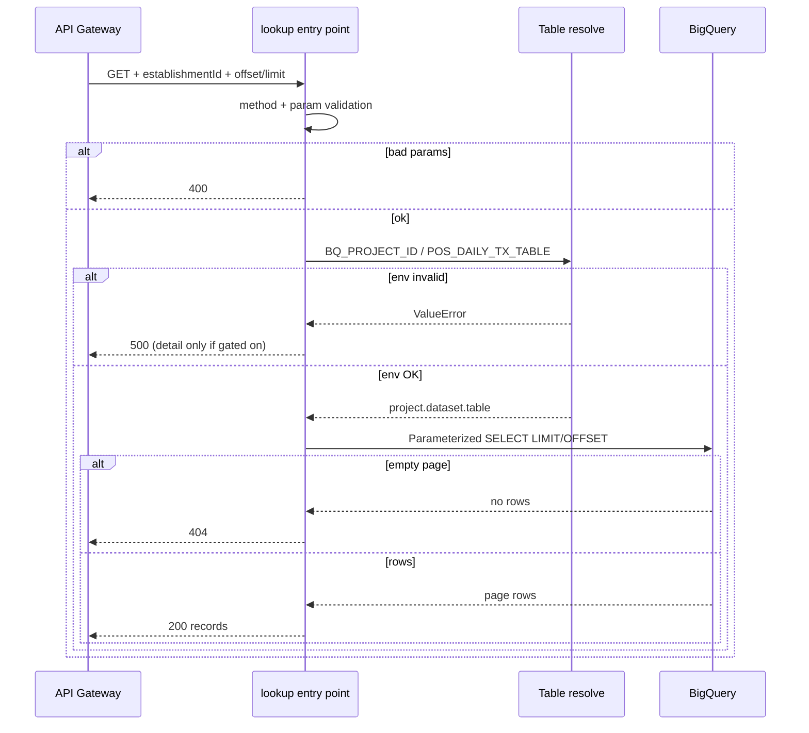

# Data flow: POS daily-transactions offset/limit handler

## Happy path

1. Client calls `GET https://GATEWAY_HOST/v3/getPOS?establishmentId=EST-1001&offset=0&limit=20` with header `X-API-Key: YOUR_API_KEY`.
2. API Gateway validates the edge key, then proxies with OIDC as the gateway SA.
3. Function:
   - Rejects non-GET with **405**
   - Requires `establishmentId` (**400** if missing)
   - Validates `offset` >= 0 and `1 <= limit <= 100`
   - Resolves table from env
   - Runs parameterized `SELECT ... LIMIT/OFFSET`
   - Returns `{records: [...]}` on success
4. Gateway returns the same status and body.

Example success body (fake data):

```json
{
  "records": [
    {
      "country": "DE",
      "persistence_id": "p-10001",
      "establishment_id": "EST-1001",
      "pos_order_date": "2026-09-20",
      "total_completed_orders": 42,
      "total_order_amount": 1850.5
    }
  ]
}
```

## Failure modes

| Symptom | Likely cause | What to check |
|---------|--------------|---------------|
| 403 from gateway | Edge API key / restriction | API & Services key config |
| 403 from backend | Invoker IAM | Gateway SA functions + run invoker |
| 400 establishmentId | Missing / blank | Query param name is `establishmentId` |
| 400 paging | Non-int, offset &lt; 0, limit out of range | Client params; MAX_LIMIT=100 |
| 404 data | Unknown id or page past end | Filters; whether the establishment has rows |
| 500 env | Missing `BQ_PROJECT_ID` / bad table | Cloud Run env on the revision |
| 500 BQ | Permissions / bad table / override typo | Runtime SA roles; logged resolved table |
| 500 with `detail` | `EXPOSE_ERROR_DETAIL` enabled | Expected in staging only |

## Logging

Log the resolved table, offset, and limit. Never log API keys, Authorization headers, or full SQL strings that embed request input (parameters keep IDs out of the query text).

When `EXPOSE_ERROR_DETAIL` is off, 500 bodies stay generic while Cloud Logging still gets `logger.exception`.

## Sequence (function-local)



## Contract note vs multi-route OpenAPI

The companion OpenAPI in this folder documents the **handler truth**: a `{records}` object. Some multi-route dashboard specs historically typed `/v3/getPOS` as a bare array. Prefer aligning the gateway schema to `{records}` when you next bump the API config — clients that already unwrap `records` will keep working.
