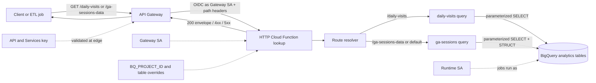
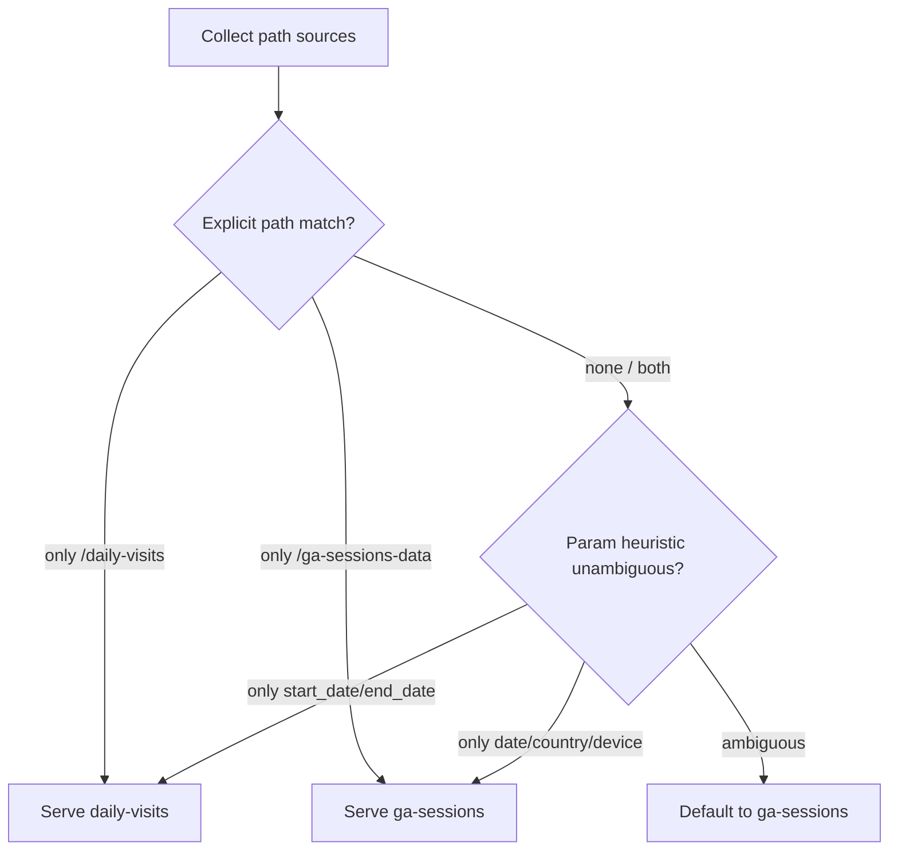

# Architecture: GA dual-path analytics handler

## Components

| Component | Role |
|-----------|------|
| Client / ETL job | Calls HTTPS with `X-API-Key` + route-specific query params |
| API Gateway | Edge OpenAPI, API key validation, path proxy to one backend |
| Gateway service account | Invoker identity for Gen2 / Cloud Run |
| HTTP Cloud Function (`lookup`) | Route resolve → parameterized query → JSON envelope |
| Path / header inputs | `path`, `X-Forwarded-Path`, `X-Envoy-Original-Path`, `X-Original-URI` |
| Env config | `BQ_PROJECT_ID`, public dataset, optional table overrides |
| Runtime service account | Identity for BigQuery jobs |
| BigQuery | Public sample (or overridden) daily visits / ga_sessions shards |

## Diagram

## Route resolution

### Env checklist

| Variable | Required | Notes |
|----------|----------|-------|
| `BQ_PROJECT_ID` | Recommended | Job/billing project for the BigQuery client |
| `PUBLIC_PROJECT_ID` | No | Defaults to `bigquery-public-data` |
| `GA_DATASET_ID` | No | Defaults to `google_analytics_sample` |
| `DAILY_VISITS_TABLE` | No | Full `project.dataset.table` override |
| `GA_SESSIONS_TABLE_TEMPLATE` | No | Template with `{date}` for shard tables |
| `EXPOSE_ERROR_DETAIL` | No | `true` / `1` / `yes` only in non-prod |
| `CORS_ALLOW_ORIGIN` | No | Defaults to `*` — set a concrete origin in prod |

### IAM checklist

1. Deploy with `--no-allow-unauthenticated`.
2. Grant gateway SA `roles/cloudfunctions.invoker` and Gen2 `roles/run.invoker`.
3. Runtime SA: BigQuery job user; data viewer on the sample or overridden datasets.
4. Restrict the edge API key to this API in API & Services.
5. Release gate: confirm both OpenAPI backends share this URI and path suffixes match the resolver strings.

## Why one backend

Two low-traffic extract routes do not justify two Cloud Run services. The cost is careful route resolution and structured logging of which path source won. Prefer separate backends only when SLOs, scaling, or blast radius diverge.
