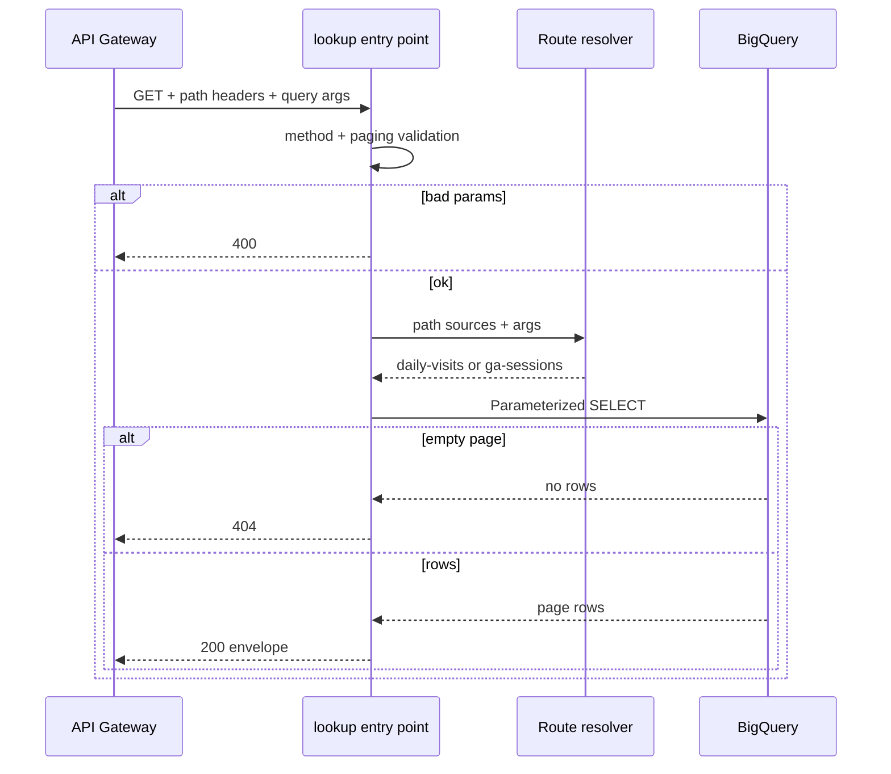

# Data flow: GA dual-path analytics handler

## Happy path — daily visits

1. Client calls `GET https://GATEWAY_HOST/daily-visits?page=1&limit=5&start_date=2017-07-01` with header `X-API-Key: YOUR_API_KEY`.
2. API Gateway validates the edge key, then proxies with OIDC as the gateway SA. Path may appear on `X-Forwarded-Path` / `X-Envoy-Original-Path` / `X-Original-URI`.
3. Function:
   - Rejects non-GET with **403**
   - Validates `page` / `limit`
   - Resolves route = `daily-visits`
   - Runs parameterized flat SELECT with optional date bounds
   - Returns `{records, pagination, filters_applied, metadata}`
4. Gateway returns the same status and body.

Example success body (fake data):

```json
{
  "records": [
    {"visit_date": "2017-07-31", "total_visits": 1204}
  ],
  "pagination": {
    "page": 1,
    "limit": 5,
    "total_records": 42,
    "total_pages": 9,
    "has_next": true,
    "has_previous": false
  },
  "filters_applied": {
    "start_date": "2017-07-01",
    "end_date": null
  },
  "metadata": {
    "records_returned": 1,
    "api_version": "1.0",
    "dataset": "bigquery-public-data.google_analytics_sample.daily_visits"
  }
}
```

## Happy path — GA sessions

1. Client calls `GET https://GATEWAY_HOST/ga-sessions-data?page=1&limit=5&date=20170801&device_category=mobile`.
2. Same edge auth and proxy as above.
3. Function resolves route = `ga-sessions`, validates `date` as `YYYYMMDD` and `device_category` against the allowlist, then runs the nested STRUCT projection query.
4. Empty result sets return **404** with `"No sessions found"`.

## Failure modes

| Symptom | Likely cause | What to check |
|---------|--------------|---------------|
| 403 from gateway | Edge API key / restriction | API & Services key config |
| 403 from backend | Invoker IAM | Gateway SA functions + run invoker |
| 403 Method not allowed | Non-GET | Client HTTP method |
| 400 paging | Non-int / page &lt; 1 / limit &lt; 1 | Client params; MAX_LIMIT=500 |
| 400 date / device | Bad `date` or `device_category` | `YYYYMMDD`; desktop/mobile/tablet |
| Wrong route served | Path headers missing + overlapping params | Cloud Logging `route_resolved` line |
| 404 data | Filters too tight or empty shard | Date suffix; filters; table override |
| 500 BQ | Permissions / missing public dataset access | Runtime SA; `BQ_PROJECT_ID` |
| 500 with `detail` | `EXPOSE_ERROR_DETAIL` enabled | Expected in staging only |

## Logging

Log resolved route, path sources (not Authorization / API key headers), table id, page, and limit. Never log full SQL with interpolated client input — parameters keep values out of the query text.

When `EXPOSE_ERROR_DETAIL` is off, 500 bodies stay generic while Cloud Logging still gets `logger.exception`.

## Sequence (function-local)



## Contract note vs gateway OpenAPI

Keep companion OpenAPI (`openapi.yaml` here and `api-gateway/03-...`) backends on the **same** function URI with path suffixes. If you collapse both addresses to a bare URI with no path, rely on forwarded headers or unambiguous query params — and treat ambiguous cases as GA by design.
